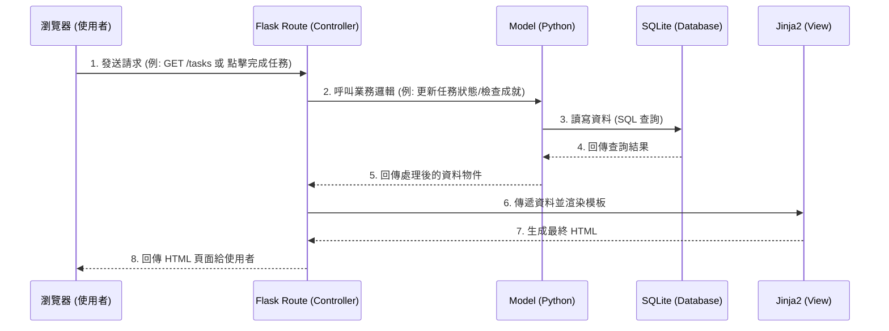

# 系統架構設計文件 (Architecture)：打怪升級待辦清單系統

## 1. 技術架構說明

本專案採用典型的後端渲染架構（Server-Side Rendering, SSR），不進行前後端分離，以求快速開發與部署。

### 1.1 選用技術與原因
- **後端框架：Python + Flask**
  - **原因**：Flask 輕量、靈活且學習曲線平緩，非常適合中小型專案或快速原型開發。
- **模板引擎：Jinja2**
  - **原因**：與 Flask 整合度高，能方便地將後端資料注入 HTML，負責視圖（View）的呈現。
- **資料庫：SQLite**
  - **原因**：內建於 Python 中，無需架設獨立的資料庫伺服器（如 MySQL 或 PostgreSQL），且對於個人任務管理系統的資料量游刃有餘。

### 1.2 Flask MVC 模式說明
專案依循類似 MVC（Model-View-Controller）的設計模式來分離職責：
- **Model（模型）**：負責與 SQLite 資料庫溝通，處理資料的讀寫、更新及業務邏輯（例如：判斷任務是否完成、成就進度計算）。
- **View（視圖）**：由 Jinja2 模板與前端技術（HTML/CSS/JS）組成，負責將資料渲染成使用者看得到的網頁介面。
- **Controller（控制器）**：即 Flask 的路由（Routes），負責接收使用者的請求（Request），呼叫對應的 Model 處理資料，最後將資料傳給 View 來產生回應（Response）。

---

## 2. 專案資料夾結構

專案採用模組化的結構，將不同的功能拆分到各自的資料夾中，以便未來維護與擴展。

```text
daily_game/
├── app/                  # 應用程式主目錄
│   ├── models/           # 模型層 (Models)：存放與資料表對應的 Python 類別或資料庫操作函式
│   │   ├── user.py       # 使用者模型
│   │   ├── task.py       # 任務模型
│   │   └── achievement.py# 成就模型
│   ├── routes/           # 路由層 (Controllers)：處理各個 URL 的請求
│   │   ├── auth.py       # 登入、註冊相關路由
│   │   ├── task.py       # 任務管理相關路由
│   │   └── index.py      # 首頁及其他共用路由
│   ├── templates/        # 視圖層 (Views)：存放 Jinja2 HTML 模板
│   │   ├── base.html     # 共用版型（包含導覽列、頁尾）
│   │   ├── index.html    # 首頁 / 任務列表頁面
│   │   ├── profile.html  # 個人成就與排行榜頁面
│   │   └── login.html    # 登入註冊頁面
│   └── static/           # 靜態資源：CSS, JavaScript, 圖片等
│       ├── css/
│       │   └── style.css
│       ├── js/
│       │   └── main.js
│       └── images/       # 存放徽章、遊戲化 UI 素材
├── instance/             # 存放特定實例的資料，如資料庫檔案（需加入 .gitignore）
│   └── database.db       # SQLite 資料庫檔案
├── docs/                 # 文件資料夾（PRD、架構圖等）
│   ├── PRD.md
│   └── ARCHITECTURE.md
├── app.py                # 程式進入點，負責初始化 Flask 應用與載入路由
├── requirements.txt      # 記錄專案相依的 Python 套件
└── README.md             # 專案說明與啟動指南
```

---

## 3. 元件關係圖

以下圖示呈現使用者從瀏覽器發送請求，到後端處理、存取資料庫並回傳頁面的完整流程。



---

## 4. 關鍵設計決策

1. **一體化渲染 (SSR) 取代前後端分離 (SPA)**
   - **原因**：為了在有限的時間內快速驗證「打怪升級」的遊戲化機制，避免前後端分離帶來的 API 設計與跨網域請求 (CORS) 複雜度。Jinja2 已經足夠處理動態資料展示。

2. **使用關聯式資料庫 (SQLite)**
   - **原因**：任務系統與成就系統之間有關聯性（例如：任務完成次數關聯到成就解鎖）。關聯式資料庫能輕易地透過 Foreign Key 和 Join 查詢來建立資料間的連結，SQLite 免安裝的特性也有利於快速開發。

3. **事件驅動的成就檢查機制**
   - **原因**：使用者的每一次「完成任務」操作（打怪），都可能是解鎖成就的契機。因此，在控制器層或模型層，當完成任務狀態更新後，會立刻呼叫成就系統的檢查邏輯，即時發放獎勵。

4. **模組化的 Blueprint 路由管理**
   - **原因**：雖然專案初期不大，但為避免 `app.py` 過於肥大，會使用 Flask 的 Blueprint 功能，將「驗證(Auth)」、「任務(Task)」、「成就(Achievement)」等路由切分到 `app/routes/` 不同的檔案中，提升程式碼可讀性。
