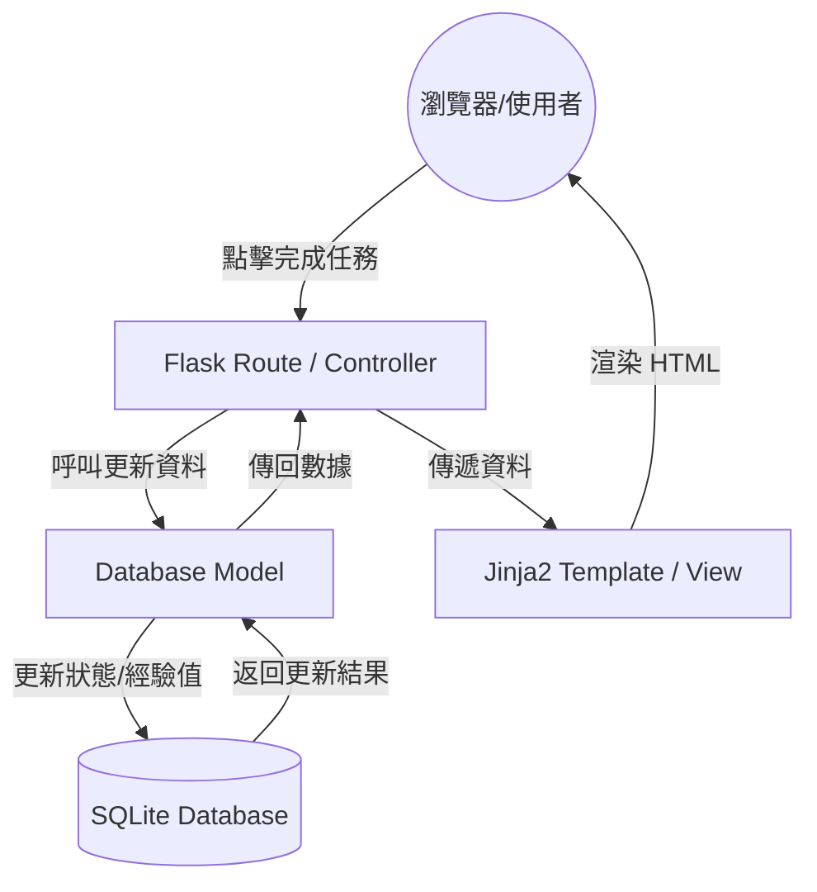

# 系統架構設計文件：生活目標追蹤+打怪系統

## 1. 技術架構說明

本專案採用經典的 **MVC (Model-View-Controller)** 架構模式，並使用 Python 的 Flask 框架進行開發。

### 選用技術與原因
- **後端框架：Flask (Python)** - 輕量級、彈性高，適合快速原型開發，且易於學習與擴充。
- **模板引擎：Jinja2** - Flask 內建，能方便地將後端邏輯與 HTML 結合，適合此專案的伺服器渲染需求。
- **資料庫：SQLite** - 無須額外安裝資料庫伺服器，單一檔案儲存，方便開發與攜帶，對於學生專題規模而言效能足夠。

### MVC 模式說明
- **Model (模型)**：負責與 SQLite 資料庫互動，定義資料表結構（如任務、角色狀態、裝備等）與資料邏輯。
- **View (視圖)**：負責顯示介面，使用 Jinja2 渲染 HTML 頁面，將資料視覺化呈現（如血條、等級）。
- **Controller (控制器)**：在 Flask 中主要透過路由（Routes）實現，接收使用者請求（如點擊完成任務），呼叫 Model 更新資料，並決定要渲染哪個 View。

## 2. 專案資料夾結構

建議採用模組化的結構，將不同職責的程式碼分開放置：

```text
daily_game/
├── app/
│   ├── models/           # 資料庫模型 (Model)
│   │   ├── __init__.py
│   │   ├── task.py       # 任務相關模型
│   │   └── user.py       # 使用者與角色屬性模型
│   ├── routes/           # 路由處理 (Controller)
│   │   ├── __init__.py
│   │   ├── auth.py       # 註冊登入路由
│   │   └── main.py       # 首頁、任務與打怪邏輯路由
│   ├── static/           # 靜態資源 (CSS, JS, Images)
│   │   ├── css/
│   │   │   └── style.css
│   │   └── js/
│   │       └── game.js
│   ├── templates/        # Jinja2 HTML 模板 (View)
│   │   ├── base.html     # 共用佈局
│   │   ├── index.html    # 遊戲大廳/首頁
│   │   └── login.html    # 登入頁面
│   └── __init__.py       # Flask App 初始化
├── docs/                 # 專案文件 (PRD, Architecture)
├── instance/             # 實例資料夾 (不進入 Git)
│   └── database.db       # SQLite 資料庫檔案
├── app.py                # 應用程式進入點 (Runner)
├── config.py             # 專案設定檔
└── requirements.txt      # 依賴套件清單
```

## 3. 元件關係圖

### 系統資料流向


## 4. 關鍵設計決策

1. **伺服器渲染 (Server-Side Rendering)**：
   - 決策：不使用 React/Vue 前後端分離，直接由 Flask + Jinja2 渲染。
   - 原因：降低開發複雜度，適合單純的專題展示，且能充分利用 Flask 的整合優勢。

2. **角色屬性與任務連動**：
   - 決策：在資料庫中設計「角色屬性表」，與「任務表」連動。
   - 原因：確保每次任務完成時，經驗值與等級的變動能即時同步到使用者角色上，並保存成長進度。

3. **靜態資源優化**：
   - 決策：將遊戲相關的視覺回饋（如血條動畫）放在 `static/js` 處理。
   - 原因：減輕後端負擔，利用客戶端 JS 處理即時的視覺過渡效果，提升使用者的「遊戲感」。

4. **資料庫獨立性**：
   - 決策：使用 `instance/` 資料夾存放 SQLite 檔案。
   - 原因：這是 Flask 的最佳實踐，可以避免資料庫檔案被誤傳到 Git，同時讓開發環境設定更清晰。
