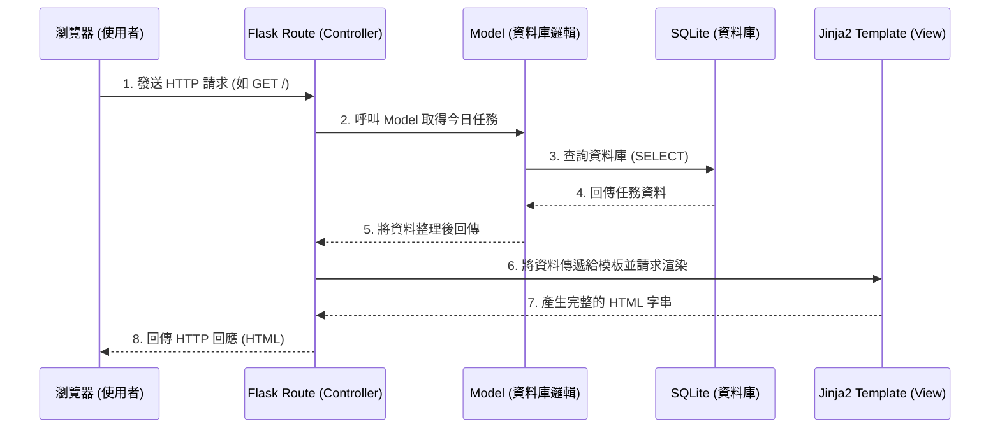

# 系統架構文件 (Architecture)

## 1. 技術架構說明

本專案採用 **Flask + Jinja2 + SQLite** 作為核心技術棧，這是一個經典且輕量級的後端架構，非常適合快速開發與小型專案。專案並沒有採用前後端分離，而是由後端直接渲染 HTML 頁面並回傳給瀏覽器。

### 選用技術與原因
* **Python (Flask)**: 輕量、容易上手，內建開發伺服器與除錯工具，適合用來快速打造應用程式的邏輯層。
* **Jinja2**: Flask 預設的樣板引擎。可以直接在 HTML 中嵌入 Python 語法（如 if 判斷、for 迴圈），將後端資料動態渲染到畫面上。
* **SQLite**: 輕量級的關聯式資料庫，不需要額外安裝資料庫伺服器，資料儲存在單一檔案中，非常適合小型專案與開發階段使用。

### Flask MVC 模式說明
雖然 Flask 本身不強制要求 MVC 架構，但我們將採用類似 MVC (Model-View-Controller) 的設計模式來分離關注點：
* **Model (模型 - 資料層)**: 負責與 SQLite 資料庫溝通，定義資料表結構（如 User, Task），並處理資料的增刪改查 (CRUD)。
* **View (視圖 - 呈現層)**: 負責使用者介面，由 Jinja2 模板 (HTML) 與靜態資源 (CSS, JS) 組成，負責將資料呈現給使用者。
* **Controller (控制器 - 邏輯層)**: 由 Flask 的 Routes（路由）擔任。負責接收使用者的請求 (Request)，呼叫對應的 Model 處理資料，並將結果傳遞給 View 進行渲染，最後回傳回應 (Response)。

---

## 2. 專案資料夾結構

以下是本專案建議的資料夾結構樹狀圖，我們將依據此結構來組織程式碼：

```text
daily_game/
│
├── app/                        # 主要應用程式目錄
│   ├── __init__.py             # 初始化 Flask 應用程式與設定
│   ├── models.py               # 資料庫模型 (Models - 定義 User, Task 等)
│   ├── routes.py               # Flask 路由控制器 (Controllers - 處理 URL 請求)
│   │
│   ├── templates/              # Jinja2 HTML 模板目錄 (Views)
│   │   ├── base.html           # 共用基礎版型 (包含導覽列、載入 CSS/JS)
│   │   ├── index.html          # 首頁 / 任務列表頁面
│   │   └── login.html          # 登入/註冊頁面
│   │
│   └── static/                 # 靜態資源目錄
│       ├── css/
│       │   └── style.css       # 樣式表
│       ├── js/
│       │   └── main.js         # 前端互動邏輯 (如打怪動畫、通知彈窗)
│       └── img/                # 圖片資源 (怪獸圖案、UI 素材)
│
├── instance/                   # 存放不應加入版控的實例專屬檔案
│   └── database.db             # SQLite 資料庫檔案 (自動生成)
│
├── docs/                       # 專案文件目錄
│   ├── PRD.md                  # 產品需求文件
│   └── ARCHITECTURE.md         # 系統架構文件 (本文件)
│
├── .gitignore                  # Git 忽略清單 (忽略 instance/, venv/ 等)
├── requirements.txt            # Python 相依套件清單
└── app.py                      # 專案啟動入口檔案 (執行此檔啟動伺服器)
```

---

## 3. 元件關係圖

以下展示當使用者透過瀏覽器操作時，系統各元件之間的資料流與協作關係：



---

## 4. 關鍵設計決策

1. **將邏輯集中在後端 (Server-Side Rendering)**
   * **原因**：為了簡化架構，減少前端開發的複雜度。透過 Jinja2 在後端渲染好帶有資料的 HTML 再傳送給瀏覽器，降低了前端 JavaScript 的依賴，適合初學者快速構建可運作的應用。
2. **使用單一檔案的 SQLite 資料庫**
   * **原因**：對於個人習慣追蹤與打怪系統，初期的資料量不大，不需要複雜的併發處理。SQLite 可以做到零配置 (Zero-configuration)，方便備份與除錯。
3. **每日任務重置邏輯的處理方式**
   * **原因**：考量到輕量化，我們不使用額外的排程工具（如 Celery 或 Cron）。而是在使用者每次登入或存取任務列表頁面時 (在 Route 層)，檢查上一次登入時間與現在時間是否跨日。如果是跨日，則觸發 Model 進行進度清空與任務刷新的邏輯，這樣可以大幅降低伺服器的閒置開銷。
4. **將應用程式拆分為 `app/` 模組**
   * **原因**：雖然可以把所有程式碼寫在單一檔案，但為了後續維護與擴展（例如增加商店系統或排行榜），將路由、模型、樣板分離到不同的檔案與目錄中，能讓程式碼更清晰易讀。
