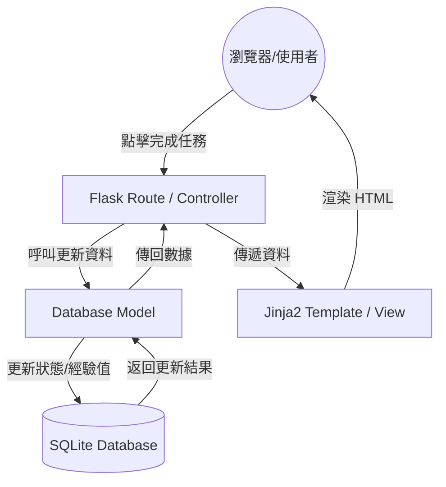

# 系統架構設計文件 (Architecture)：打怪升級待辦清單系統

## 1. 技術架構說明

本專案採用典型的後端渲染架構（Server-Side Rendering, SSR），不進行前後端分離，以求快速開發與部署。

### 1.1 選用技術與原因
- **後端框架：Python + Flask**
  - **原因**：Flask 輕量、靈活且學習曲線平緩，非常適合中小型專案或快速原型開發。
- **模板引擎：Jinja2**
  - **原因**：與 Flask 整合度高，能方便地將後端資料注入 HTML，負責視圖（View）的呈現。
- **資料庫：SQLite**
  - **原因**：內建於 Python 中，無需架設獨立的資料庫伺服器（如 MySQL 或 PostgreSQL），且對於個人任務管理系統的資料量游刃有餘。

### 1.2 Flask MVC 模式說明
專案依循類似 MVC（Model-View-Controller）的設計模式來分離職責：
- **Model（模型）**：負責與 SQLite 資料庫溝通，處理資料的讀寫、更新及業務邏輯（例如：判斷任務是否完成、成就進度計算）。
- **View（視圖）**：由 Jinja2 模板與前端技術（HTML/CSS/JS）組成，負責將資料渲染成使用者看得到的網頁介面。
- **Controller（控制器）**：即 Flask 的路由（Routes），負責接收使用者的請求（Request），呼叫對應的 Model 處理資料，最後將資料傳給 View 來產生回應（Response）。
# 系統架構設計文件 (ARCHITECTURE)：生活目標打怪追蹤系統 (Daily Game)

## 1. 技術架構說明

### 1.1 選用技術與原因
- **後端框架：Python + Flask**
  - **原因**：Flask 輕量、靈活且容易上手，非常適合用於開發中小型專案與 MVP（最小可行性產品）。Python 語法簡潔，能快速實作業務邏輯。
- **模板引擎：Jinja2**
  - **原因**：作為 Flask 內建的模板引擎，Jinja2 可以直接在伺服器端將資料（如使用者資訊、任務列表、怪物狀態）與 HTML 結合，渲染成完整的網頁後再傳回給瀏覽器，不需要處理複雜的前後端 API 串接。
- **資料庫：SQLite (搭配 SQLAlchemy 或內建 sqlite3)**
  - **原因**：SQLite 是輕量級關聯式資料庫，資料直接儲存於本地檔案（如 `database.db`），無需額外安裝或架設資料庫伺服器，非常適合本專案初期的單機部署與測試。
- **前端：HTML, Vanilla CSS, JavaScript**
  - **原因**：使用原生技術即可達成動態回饋（如攻擊怪物的動畫或血條扣減）與遊戲化的視覺效果，保持專案的簡單性與可維護性。

### 1.2 Flask MVC 模式說明
本專案採用類似 **MVC (Model-View-Controller)** 的架構來組織程式碼：
- **Model (模型)**：負責與資料庫互動，定義資料表結構（如 User, Task, Monster）以及資料存取邏輯。
- **View (視圖)**：負責呈現使用者介面。在本作中，即是 `templates` 資料夾下的 Jinja2 HTML 模板，負責把 Controller 傳來的資料渲染成網頁。
- **Controller (控制器)**：負責接收使用者的請求並處理業務邏輯。在 Flask 中，即是 `routes`（路由）。它會呼叫 Model 取得或更新資料，然後把結果傳給 View 進行渲染。
# 系統架構設計文件：生活目標追蹤+打怪系統

## 1. 技術架構說明

本專案採用經典的 **MVC (Model-View-Controller)** 架構模式，並使用 Python 的 Flask 框架進行開發。

### 選用技術與原因
- **後端框架：Flask (Python)** - 輕量級、彈性高，適合快速原型開發，且易於學習與擴充。
- **模板引擎：Jinja2** - Flask 內建，能方便地將後端邏輯與 HTML 結合，適合此專案的伺服器渲染需求。
- **資料庫：SQLite** - 無須額外安裝資料庫伺服器，單一檔案儲存，方便開發與攜帶，對於學生專題規模而言效能足夠。

### MVC 模式說明
- **Model (模型)**：負責與 SQLite 資料庫互動，定義資料表結構（如任務、角色狀態、裝備等）與資料邏輯。
- **View (視圖)**：負責顯示介面，使用 Jinja2 渲染 HTML 頁面，將資料視覺化呈現（如血條、等級）。
- **Controller (控制器)**：在 Flask 中主要透過路由（Routes）實現，接收使用者請求（如點擊完成任務），呼叫 Model 更新資料，並決定要渲染哪個 View。

## 2. 專案資料夾結構

建議採用模組化的結構，將不同職責的程式碼分開放置：
# 系統架構設計文件 (ARCHITECTURE.md)

本文件基於 [PRD.md](file:///c:/Users/User/Desktop/daily_game/docs/PRD.md) 的需求，定義「生活目標追蹤 + 打怪系統」的技術架構與實作方案。

## 1. 技術架構說明

本系統採用 **Flask** 作為核心框架，並遵循簡化的 **MVC (Model-View-Controller)** 模式：

- **Model (模型)**：使用 SQLite 儲存資料，負責定義使用者、任務、怪物與進度等資料結構。
- **View (視圖)**：使用 Jinja2 模板引擎進行伺服器端渲染 (SSR)，負責產出 HTML 頁面並結合 CSS 與 JavaScript 進行美化與互動。
- **Controller (控制器)**：由 Flask 的路由 (Routes) 擔任，負責處理瀏覽器請求、執行業務邏輯，並決定回傳哪個 View。

### 選用技術與原因
- **Python + Flask**：輕量、易於上手，適合快速開發 MVP。
- **SQLite**：無須安裝額外伺服器，單一檔案即可運作，適合個人化與中小型專案。
- **Jinja2**：Flask 內建，能輕鬆將後端資料注入 HTML，減少前端串接 API 的複雜度。
# 系統架構設計 — 生活目標加打怪系統

## 1. 技術架構說明

本系統採用經典的 **MVC (Model-View-Controller)** 模式進行開發，以確保程式碼結構清晰且易於維護。

### 選用技術與原因
- **後端：Python + Flask**
  - 原因：Flask 是一個輕量級的 Web 框架，適合快速開發與專案原型製作，對於初學者來說學習曲線較平緩。
- **模板引擎：Jinja2**
  - 原因：Flask 內建支援，能直接在 HTML 中嵌入 Python 變數與邏輯，實現伺服器端渲染（Server-side Rendering），簡化開發流程。
- **資料庫：SQLite**
  - 原因：零設定、檔案式資料庫，無需額外安裝伺服器軟體，適合中小型專案或個人專題。
- **認證與安全性：Werkzeug (Password Hashing)**
  - 原因：Flask 內建安全工具，能輕鬆實作密碼雜湊與比對。

### MVC 模式分工
- **Model (模型)**：負責定義資料結構（如使用者資訊、任務內容、怪物數值）以及與 SQLite 資料庫的溝通。
- **View (視圖)**：由 Jinja2 模板構成，負責產出給瀏覽器呈現的 HTML 頁面與 UI 介面。
- **Controller (控制器)**：由 Flask 的路由（Routes）組成，負責接收使用者的請求、調用 Model 處理資料，並決定最後要渲染哪一個 View。

---

## 2. 專案資料夾結構

專案採用模組化的結構，將不同的功能拆分到各自的資料夾中，以便未來維護與擴展。

```text
daily_game/
├── app/                  # 應用程式主目錄
│   ├── models/           # 模型層 (Models)：存放與資料表對應的 Python 類別或資料庫操作函式
│   │   ├── user.py       # 使用者模型
│   │   ├── task.py       # 任務模型
│   │   └── achievement.py# 成就模型
│   ├── routes/           # 路由層 (Controllers)：處理各個 URL 的請求
│   │   ├── auth.py       # 登入、註冊相關路由
│   │   ├── task.py       # 任務管理相關路由
│   │   └── index.py      # 首頁及其他共用路由
│   ├── templates/        # 視圖層 (Views)：存放 Jinja2 HTML 模板
│   │   ├── base.html     # 共用版型（包含導覽列、頁尾）
│   │   ├── index.html    # 首頁 / 任務列表頁面
│   │   ├── profile.html  # 個人成就與排行榜頁面
│   │   └── login.html    # 登入註冊頁面
│   └── static/           # 靜態資源：CSS, JavaScript, 圖片等
│       ├── css/
│       │   └── style.css
│       ├── js/
│       │   └── main.js
│       └── images/       # 存放徽章、遊戲化 UI 素材
├── instance/             # 存放特定實例的資料，如資料庫檔案（需加入 .gitignore）
│   └── database.db       # SQLite 資料庫檔案
├── docs/                 # 文件資料夾（PRD、架構圖等）
│   ├── PRD.md
│   └── ARCHITECTURE.md
├── app.py                # 程式進入點，負責初始化 Flask 應用與載入路由
├── requirements.txt      # 記錄專案相依的 Python 套件
└── README.md             # 專案說明與啟動指南
```text
daily_game/
├── app/
│   ├── models/           # 模型層：定義資料庫 Schema 與操作邏輯
│   │   ├── user.py       # 使用者模型 (包含等級、經驗值)
│   │   ├── task.py       # 任務模型 (任務內容、狀態)
│   │   └── monster.py    # 怪物模型 (血量、圖片路徑)
│   ├── routes/           # 控制層：Flask 路由與業務邏輯
│   │   ├── auth.py       # 註冊與登入路由
│   │   ├── tasks.py      # 任務 CRUD 與打怪邏輯路由
│   │   └── main.py       # 首頁與遊戲主畫面路由
│   ├── templates/        # 視圖層：Jinja2 HTML 模板
│   │   ├── base.html     # 共用版型 (Header, Footer, 導覽列)
│   │   ├── index.html    # 首頁 / 打怪主畫面
│   │   ├── login.html    # 登入註冊頁
│   │   └── tasks.html    # 任務管理頁面
│   └── static/           # 靜態資源檔案
│       ├── css/
│       │   └── style.css # 遊戲化風格樣式表
│       ├── js/
│       │   └── main.js   # 處理前端互動 (如打擊特效)
│       └── images/       # 存放怪物圖片、裝備圖示等
├── instance/
│   └── database.db       # SQLite 資料庫檔案 (系統自動產生)
├── docs/                 # 專案文件
│   ├── PRD.md            # 產品需求文件
│   └── ARCHITECTURE.md   # 系統架構文件 (本文件)
├── app.py                # 應用程式進入點，負責初始化 Flask 與載入設定
└── requirements.txt      # 記錄 Python 依賴套件 (如 Flask)
建議採用模組化的結構，方便未來擴充功能：

```text
daily_game/
├── app/
│   ├── models/           # 資料庫模型 (Model)
│   │   ├── __init__.py
│   │   ├── task.py       # 任務相關模型
│   │   └── user.py       # 使用者與角色屬性模型
│   ├── routes/           # 路由處理 (Controller)
│   │   ├── __init__.py
│   │   ├── auth.py       # 註冊登入路由
│   │   └── main.py       # 首頁、任務與打怪邏輯路由
│   ├── static/           # 靜態資源 (CSS, JS, Images)
│   │   ├── css/
│   │   │   └── style.css
│   │   └── js/
│   │       └── game.js
│   ├── templates/        # Jinja2 HTML 模板 (View)
│   │   ├── base.html     # 共用佈局
│   │   ├── index.html    # 遊戲大廳/首頁
│   │   └── login.html    # 登入頁面
│   └── __init__.py       # Flask App 初始化
├── docs/                 # 專案文件 (PRD, Architecture)
├── instance/             # 實例資料夾 (不進入 Git)
│   └── database.db       # SQLite 資料庫檔案
├── app.py                # 應用程式進入點 (Runner)
├── config.py             # 專案設定檔
└── requirements.txt      # 依賴套件清單
```

## 3. 元件關係圖

### 系統資料流向


## 4. 關鍵設計決策

1. **伺服器渲染 (Server-Side Rendering)**：
   - 決策：不使用 React/Vue 前後端分離，直接由 Flask + Jinja2 渲染。
   - 原因：降低開發複雜度，適合單純的專題展示，且能充分利用 Flask 的整合優勢。

2. **角色屬性與任務連動**：
   - 決策：在資料庫中設計「角色屬性表」，與「任務表」連動。
   - 原因：確保每次任務完成時，經驗值與等級的變動能即時同步到使用者角色上，並保存成長進度。

3. **靜態資源優化**：
   - 決策：將遊戲相關的視覺回饋（如血條動畫）放在 `static/js` 處理。
   - 原因：減輕後端負擔，利用客戶端 JS 處理即時的視覺過渡效果，提升使用者的「遊戲感」。

4. **資料庫獨立性**：
   - 決策：使用 `instance/` 資料夾存放 SQLite 檔案。
   - 原因：這是 Flask 的最佳實踐，可以避免資料庫檔案被誤傳到 Git，同時讓開發環境設定更清晰。
│   ├── __init__.py          # 初始化 Flask App 與資料庫
│   ├── models.py            # 定義資料表模型 (User, Task, Monster)
│   ├── routes/              # 業務邏輯路由
│   │   ├── auth.py          # 註冊與登入
│   │   ├── tasks.py         # 任務管理
│   │   └── combat.py        # 戰鬥邏輯與怪物更新
│   ├── templates/           # Jinja2 HTML 模板
│   │   ├── base.html        # 共用導覽列與 Layout
│   │   ├── index.html       # 首頁 (儀表板)
│   │   ├── login.html       # 登入頁
│   │   ├── tasks.html       # 任務列表
│   │   └── combat.html      # 戰鬥畫面
│   └── static/              # 靜態資源
│       ├── css/             # CSS 樣式表
│       ├── js/              # JavaScript 互動腳本
│       └── images/          # 怪物圖片、道具圖示
├── docs/
│   ├── PRD.md               # 產品需求文件
│   └── ARCHITECTURE.md      # 系統架構文件
├── instance/
│   └── database.db          # SQLite 資料庫檔案 (運行時產生)
├── app.py                   # 專案啟動入口
├── requirements.txt         # 專案依賴套件
└── .gitignore               # 排除不必要的檔案
建議採用以下結構來組織程式碼，將不同功能的程式碼區隔開來：

```text
daily_game/
├── app/                  # 應用程式核心目錄
│   ├── __init__.py       # 初始化 Flask App 與套件設定
│   ├── models/           # 資料庫模型 (Model)
│   │   ├── __init__.py
│   │   ├── user.py       # 使用者模型
│   │   ├── task.py       # 任務模型
│   │   └── monster.py    # 怪物與角色模型
│   ├── routes/           # 路由邏輯 (Controller)
│   │   ├── __init__.py
│   │   ├── auth.py       # 註冊、登入邏輯
│   │   ├── main.py       # 首頁與打怪主邏輯
│   │   └── tasks.py      # 任務管理邏輯
│   ├── templates/        # Jinja2 HTML 模板 (View)
│   │   ├── base.html     # 共用佈局 (Navbar, Footer)
│   │   ├── index.html    # 遊戲大廳/首頁
│   │   ├── login.html    # 登入頁面
│   │   └── tasks.md      # 任務列表頁面
│   └── static/           # 靜態資源
│       ├── css/          # 樣式表 (style.css)
│       ├── js/           # 前端互動邏輯 (script.js)
│       └── images/       # 怪物圖、角色圖等素材
├── instance/             # 存放實例特定檔案 (不進入 Git 追蹤)
│   └── database.db       # SQLite 資料庫檔案
├── docs/                 # 專案文件 (PRD, Architecture)
├── .gitignore            # 排除不需上傳的檔案 (如 __pycache__)
├── app.py                # 專案啟動入口
└── requirements.txt      # 專案套件依賴清單
```

---

## 3. 元件關係圖

以下圖示呈現使用者從瀏覽器發送請求，到後端處理、存取資料庫並回傳頁面的完整流程。
以下展示使用者從瀏覽器發出請求後，系統內部元件的處理流程：

```mermaid
sequenceDiagram
    participant Browser as 瀏覽器 (使用者)
    participant Route as Flask Route (Controller)
    participant Model as Model (Python)
    participant DB as SQLite (Database)
    participant Template as Jinja2 (View)

    Browser->>Route: 1. 發送請求 (例: GET /tasks 或 點擊完成任務)
    Route->>Model: 2. 呼叫業務邏輯 (例: 更新任務狀態/檢查成就)
    Model->>DB: 3. 讀寫資料 (SQL 查詢)
    DB-->>Model: 4. 回傳查詢結果
    Model-->>Route: 5. 回傳處理後的資料物件
    Route->>Template: 6. 傳遞資料並渲染模板
    Template-->>Route: 7. 生成最終 HTML
    Route-->>Browser: 8. 回傳 HTML 頁面給使用者
    participant Model as Model (資料庫邏輯)
    participant DB as SQLite (database.db)
    participant Template as Jinja2 Template (View)

    Browser->>Route: 1. 發送請求 (例如：點擊「完成任務」)
    Route->>Model: 2. 處理邏輯 (扣除怪物血量、增加經驗值)
    Model->>DB: 3. 執行 SQL 更新資料
    DB-->>Model: 4. 回傳更新結果
    Model-->>Route: 5. 邏輯處理完成
    Route->>Template: 6. 傳遞最新資料 (新血量、新等級)
    Template-->>Route: 7. 渲染 HTML 頁面
    Route-->>Browser: 8. 回傳完整網頁並顯示結果
```mermaid
graph TD
    User((使用者)) -->|操作瀏覽器| Browser[瀏覽器]
    Browser -->|HTTP Request| Flask_Routes[Flask Routes / Controller]
    
    subgraph Backend [Flask 後端]
        Flask_Routes -->|存取資料| Models[Models / SQL]
        Models <-->|讀寫| SQLite[(SQLite Database)]
        
        Flask_Routes -->|傳遞資料| Jinja2[Jinja2 Template / View]
        Jinja2 -->|渲染頁面| HTML_Result[HTML + CSS + JS]
    end
    
    HTML_Result -->|HTTP Response| Browser
以下圖示呈現了從使用者操作到系統回應的資料流向：

```mermaid
graph LR
    User((瀏覽器)) -- 1. 請求 (GET/POST) --> Controller[Flask Route]
    Controller -- 2. 查詢/存取資料 --> Model[SQLAlchemy/Models]
    Model -- 3. SQL 指令 --> DB[(SQLite Database)]
    DB -- 4. 回傳資料 --> Model
    Model -- 5. 封裝成物件 --> Controller
    Controller -- 6. 傳遞變數 --> View[Jinja2 Template]
    View -- 7. 渲染完成 HTML --> User
```

---

## 4. 關鍵設計決策

1. **一體化渲染 (SSR) 取代前後端分離 (SPA)**
   - **原因**：為了在有限的時間內快速驗證「打怪升級」的遊戲化機制，避免前後端分離帶來的 API 設計與跨網域請求 (CORS) 複雜度。Jinja2 已經足夠處理動態資料展示。

2. **使用關聯式資料庫 (SQLite)**
   - **原因**：任務系統與成就系統之間有關聯性（例如：任務完成次數關聯到成就解鎖）。關聯式資料庫能輕易地透過 Foreign Key 和 Join 查詢來建立資料間的連結，SQLite 免安裝的特性也有利於快速開發。

3. **事件驅動的成就檢查機制**
   - **原因**：使用者的每一次「完成任務」操作（打怪），都可能是解鎖成就的契機。因此，在控制器層或模型層，當完成任務狀態更新後，會立刻呼叫成就系統的檢查邏輯，即時發放獎勵。

4. **模組化的 Blueprint 路由管理**
   - **原因**：雖然專案初期不大，但為避免 `app.py` 過於肥大，會使用 Flask 的 Blueprint 功能，將「驗證(Auth)」、「任務(Task)」、「成就(Achievement)」等路由切分到 `app/routes/` 不同的檔案中，提升程式碼可讀性。
1. **不採用前後端分離架構（Server-Side Rendering）**
   - **原因**：為了在短時間內完成 MVP，避免處理複雜的 CORS 問題與 API 狀態管理。透過 Flask 與 Jinja2 在伺服器端直接渲染畫面，可以大幅加快開發速度，且對於初學者來說更容易除錯。

2. **打怪邏輯與任務完成綁定**
   - **原因**：將核心的遊戲化體驗直接整合在任務系統中。當使用者在 `tasks.py` 路由中觸發「完成任務」的請求時，後端會同時呼叫 Task Model 更新任務狀態，以及 User Model 與 Monster Model 來計算經驗值與扣減怪物血量。這確保了資料的一致性，防止任務完成但怪物沒扣血的情況。

3. **使用 SQLite 作為資料儲存**
   - **原因**：考量到目標用戶多為個人使用，且資料量不大（文字為主的任務與簡單的數字狀態），SQLite 完全足以應付效能需求，並且降低了專案部署與開發環境設定的門檻。

4. **集中管理路由模組 (Blueprints)**
   - **原因**：雖然專案初期規模不大，但為了後續維護與擴展（例如新增裝備系統或商店系統），將路由依功能拆分為 `auth.py`, `tasks.py`, `main.py`。這能避免 `app.py` 變得過於龐大且難以閱讀。
1. **伺服器端渲染 (SSR) vs. 前後端分離**
   - **決策**：採用 SSR。
   - **原因**：考量到開發速度與複雜度，SSR 可以直接在 Python 處理好邏輯後渲染，省去建立繁瑣 API 與前端狀態管理的時間。

2. **路由模組化 (Blueprints)**
   - **決策**：將註冊登入、任務、戰鬥分開放在不同的路由檔案中。
   - **原因**：避免 `app.py` 變得過於龐大，且讓各個功能的職責清晰。

3. **戰鬥觸發機制**
   - **決策**：當使用者勾選「完成任務」時，由後端計算傷害並同步更新怪物的 HP。
   - **原因**：確保遊戲數據的正確性與安全性，防止使用者在前端直接修改傷害數值。

4. **資料庫連線管理**
   - **決策**：使用 Flask-SQLAlchemy 或直接封裝 sqlite3 操作。
   - **原因**：提供更直觀的物件導向方式操作資料，提高程式碼的可讀性。

---
*文件更新日期：2026-05-14*
1.  **採用伺服器端渲染 (SSR)**：
    由於本專案主要目標是讓初學者快速掌握全端開發，採用 Flask + Jinja2 直接渲染頁面，可以省去前端框架（如 React/Vue）與 API 通訊的複雜度，開發效率更高。
2.  **模組化路由 (Blueprints)**：
    即使是小型專案，也將認證 (`auth`)、任務 (`tasks`) 與主遊戲邏輯 (`main`) 分開撰寫，能避免 `app.py` 變得過於肥大，也方便多人協作。
3.  **基礎狀態機設計**：
    打怪機制將透過 Controller 判斷任務完成狀態，並即時更新 Model 中的角色經驗值與怪物血量，這確保了資料的一致性與遊戲邏輯的嚴謹。
4.  **靜態資源管理**：
    將圖片、CSS 與 JS 集中在 `static` 目錄，並在 `base.html` 中統籌引用，方便全站樣式的統一與資源重用。

---
