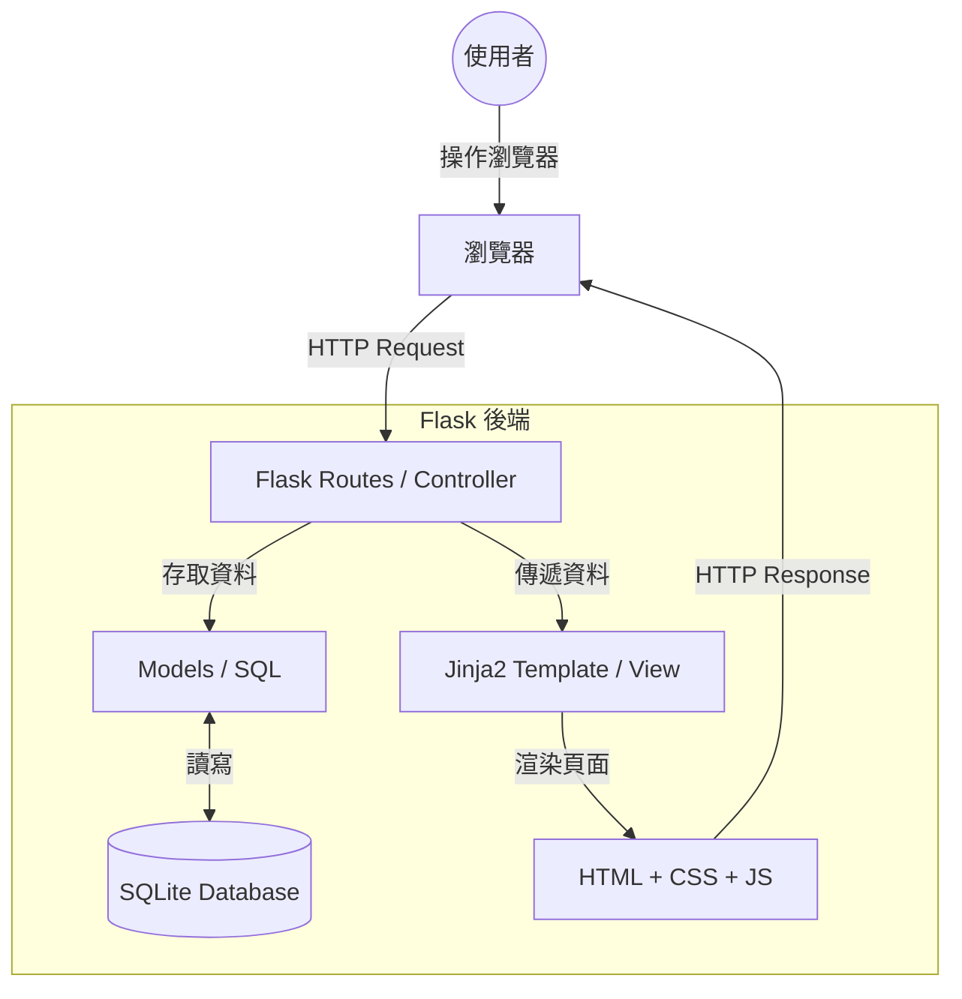

# 系統架構設計文件 (ARCHITECTURE.md)

本文件基於 [PRD.md](file:///c:/Users/User/Desktop/daily_game/docs/PRD.md) 的需求，定義「生活目標追蹤 + 打怪系統」的技術架構與實作方案。

## 1. 技術架構說明

本系統採用 **Flask** 作為核心框架，並遵循簡化的 **MVC (Model-View-Controller)** 模式：

- **Model (模型)**：使用 SQLite 儲存資料，負責定義使用者、任務、怪物與進度等資料結構。
- **View (視圖)**：使用 Jinja2 模板引擎進行伺服器端渲染 (SSR)，負責產出 HTML 頁面並結合 CSS 與 JavaScript 進行美化與互動。
- **Controller (控制器)**：由 Flask 的路由 (Routes) 擔任，負責處理瀏覽器請求、執行業務邏輯，並決定回傳哪個 View。

### 選用技術與原因
- **Python + Flask**：輕量、易於上手，適合快速開發 MVP。
- **SQLite**：無須安裝額外伺服器，單一檔案即可運作，適合個人化與中小型專案。
- **Jinja2**：Flask 內建，能輕鬆將後端資料注入 HTML，減少前端串接 API 的複雜度。

---

## 2. 專案資料夾結構

建議採用模組化的結構，方便未來擴充功能：

```text
daily_game/
├── app/
│   ├── __init__.py          # 初始化 Flask App 與資料庫
│   ├── models.py            # 定義資料表模型 (User, Task, Monster)
│   ├── routes/              # 業務邏輯路由
│   │   ├── auth.py          # 註冊與登入
│   │   ├── tasks.py         # 任務管理
│   │   └── combat.py        # 戰鬥邏輯與怪物更新
│   ├── templates/           # Jinja2 HTML 模板
│   │   ├── base.html        # 共用導覽列與 Layout
│   │   ├── index.html       # 首頁 (儀表板)
│   │   ├── login.html       # 登入頁
│   │   ├── tasks.html       # 任務列表
│   │   └── combat.html      # 戰鬥畫面
│   └── static/              # 靜態資源
│       ├── css/             # CSS 樣式表
│       ├── js/              # JavaScript 互動腳本
│       └── images/          # 怪物圖片、道具圖示
├── docs/
│   ├── PRD.md               # 產品需求文件
│   └── ARCHITECTURE.md      # 系統架構文件
├── instance/
│   └── database.db          # SQLite 資料庫檔案 (運行時產生)
├── app.py                   # 專案啟動入口
├── requirements.txt         # 專案依賴套件
└── .gitignore               # 排除不必要的檔案
```

---

## 3. 元件關係圖



---

## 4. 關鍵設計決策

1. **伺服器端渲染 (SSR) vs. 前後端分離**
   - **決策**：採用 SSR。
   - **原因**：考量到開發速度與複雜度，SSR 可以直接在 Python 處理好邏輯後渲染，省去建立繁瑣 API 與前端狀態管理的時間。

2. **路由模組化 (Blueprints)**
   - **決策**：將註冊登入、任務、戰鬥分開放在不同的路由檔案中。
   - **原因**：避免 `app.py` 變得過於龐大，且讓各個功能的職責清晰。

3. **戰鬥觸發機制**
   - **決策**：當使用者勾選「完成任務」時，由後端計算傷害並同步更新怪物的 HP。
   - **原因**：確保遊戲數據的正確性與安全性，防止使用者在前端直接修改傷害數值。

4. **資料庫連線管理**
   - **決策**：使用 Flask-SQLAlchemy 或直接封裝 sqlite3 操作。
   - **原因**：提供更直觀的物件導向方式操作資料，提高程式碼的可讀性。

---
*文件更新日期：2026-05-14*
