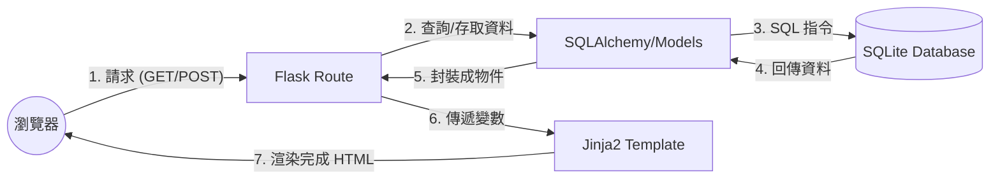

# 系統架構設計 — 生活目標加打怪系統

## 1. 技術架構說明

本系統採用經典的 **MVC (Model-View-Controller)** 模式進行開發，以確保程式碼結構清晰且易於維護。

### 選用技術與原因
- **後端：Python + Flask**
  - 原因：Flask 是一個輕量級的 Web 框架，適合快速開發與專案原型製作，對於初學者來說學習曲線較平緩。
- **模板引擎：Jinja2**
  - 原因：Flask 內建支援，能直接在 HTML 中嵌入 Python 變數與邏輯，實現伺服器端渲染（Server-side Rendering），簡化開發流程。
- **資料庫：SQLite**
  - 原因：零設定、檔案式資料庫，無需額外安裝伺服器軟體，適合中小型專案或個人專題。
- **認證與安全性：Werkzeug (Password Hashing)**
  - 原因：Flask 內建安全工具，能輕鬆實作密碼雜湊與比對。

### MVC 模式分工
- **Model (模型)**：負責定義資料結構（如使用者資訊、任務內容、怪物數值）以及與 SQLite 資料庫的溝通。
- **View (視圖)**：由 Jinja2 模板構成，負責產出給瀏覽器呈現的 HTML 頁面與 UI 介面。
- **Controller (控制器)**：由 Flask 的路由（Routes）組成，負責接收使用者的請求、調用 Model 處理資料，並決定最後要渲染哪一個 View。

---

## 2. 專案資料夾結構

建議採用以下結構來組織程式碼，將不同功能的程式碼區隔開來：

```text
daily_game/
├── app/                  # 應用程式核心目錄
│   ├── __init__.py       # 初始化 Flask App 與套件設定
│   ├── models/           # 資料庫模型 (Model)
│   │   ├── __init__.py
│   │   ├── user.py       # 使用者模型
│   │   ├── task.py       # 任務模型
│   │   └── monster.py    # 怪物與角色模型
│   ├── routes/           # 路由邏輯 (Controller)
│   │   ├── __init__.py
│   │   ├── auth.py       # 註冊、登入邏輯
│   │   ├── main.py       # 首頁與打怪主邏輯
│   │   └── tasks.py      # 任務管理邏輯
│   ├── templates/        # Jinja2 HTML 模板 (View)
│   │   ├── base.html     # 共用佈局 (Navbar, Footer)
│   │   ├── index.html    # 遊戲大廳/首頁
│   │   ├── login.html    # 登入頁面
│   │   └── tasks.md      # 任務列表頁面
│   └── static/           # 靜態資源
│       ├── css/          # 樣式表 (style.css)
│       ├── js/           # 前端互動邏輯 (script.js)
│       └── images/       # 怪物圖、角色圖等素材
├── instance/             # 存放實例特定檔案 (不進入 Git 追蹤)
│   └── database.db       # SQLite 資料庫檔案
├── docs/                 # 專案文件 (PRD, Architecture)
├── .gitignore            # 排除不需上傳的檔案 (如 __pycache__)
├── app.py                # 專案啟動入口
└── requirements.txt      # 專案套件依賴清單
```

---

## 3. 元件關係圖

以下圖示呈現了從使用者操作到系統回應的資料流向：



---

## 4. 關鍵設計決策

1.  **採用伺服器端渲染 (SSR)**：
    由於本專案主要目標是讓初學者快速掌握全端開發，採用 Flask + Jinja2 直接渲染頁面，可以省去前端框架（如 React/Vue）與 API 通訊的複雜度，開發效率更高。
2.  **模組化路由 (Blueprints)**：
    即使是小型專案，也將認證 (`auth`)、任務 (`tasks`) 與主遊戲邏輯 (`main`) 分開撰寫，能避免 `app.py` 變得過於肥大，也方便多人協作。
3.  **基礎狀態機設計**：
    打怪機制將透過 Controller 判斷任務完成狀態，並即時更新 Model 中的角色經驗值與怪物血量，這確保了資料的一致性與遊戲邏輯的嚴謹。
4.  **靜態資源管理**：
    將圖片、CSS 與 JS 集中在 `static` 目錄，並在 `base.html` 中統籌引用，方便全站樣式的統一與資源重用。

---
