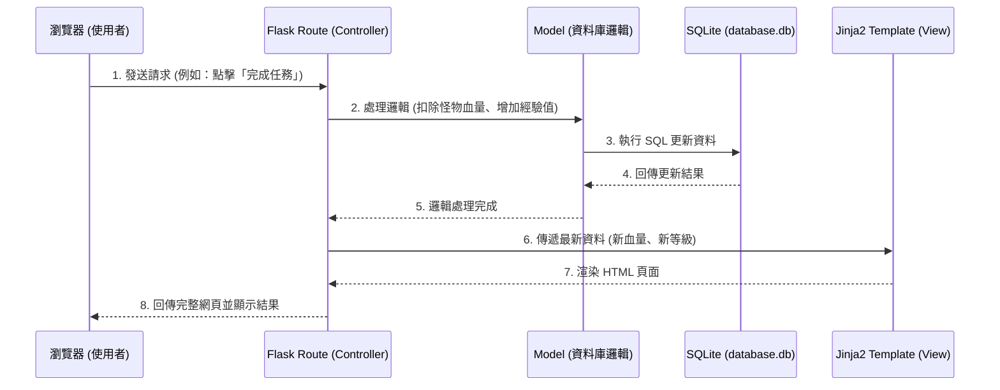

# 系統架構設計文件 (ARCHITECTURE)：生活目標打怪追蹤系統 (Daily Game)

## 1. 技術架構說明

### 1.1 選用技術與原因
- **後端框架：Python + Flask**
  - **原因**：Flask 輕量、靈活且容易上手，非常適合用於開發中小型專案與 MVP（最小可行性產品）。Python 語法簡潔，能快速實作業務邏輯。
- **模板引擎：Jinja2**
  - **原因**：作為 Flask 內建的模板引擎，Jinja2 可以直接在伺服器端將資料（如使用者資訊、任務列表、怪物狀態）與 HTML 結合，渲染成完整的網頁後再傳回給瀏覽器，不需要處理複雜的前後端 API 串接。
- **資料庫：SQLite (搭配 SQLAlchemy 或內建 sqlite3)**
  - **原因**：SQLite 是輕量級關聯式資料庫，資料直接儲存於本地檔案（如 `database.db`），無需額外安裝或架設資料庫伺服器，非常適合本專案初期的單機部署與測試。
- **前端：HTML, Vanilla CSS, JavaScript**
  - **原因**：使用原生技術即可達成動態回饋（如攻擊怪物的動畫或血條扣減）與遊戲化的視覺效果，保持專案的簡單性與可維護性。

### 1.2 Flask MVC 模式說明
本專案採用類似 **MVC (Model-View-Controller)** 的架構來組織程式碼：
- **Model (模型)**：負責與資料庫互動，定義資料表結構（如 User, Task, Monster）以及資料存取邏輯。
- **View (視圖)**：負責呈現使用者介面。在本作中，即是 `templates` 資料夾下的 Jinja2 HTML 模板，負責把 Controller 傳來的資料渲染成網頁。
- **Controller (控制器)**：負責接收使用者的請求並處理業務邏輯。在 Flask 中，即是 `routes`（路由）。它會呼叫 Model 取得或更新資料，然後把結果傳給 View 進行渲染。

---

## 2. 專案資料夾結構

```text
daily_game/
├── app/
│   ├── models/           # 模型層：定義資料庫 Schema 與操作邏輯
│   │   ├── user.py       # 使用者模型 (包含等級、經驗值)
│   │   ├── task.py       # 任務模型 (任務內容、狀態)
│   │   └── monster.py    # 怪物模型 (血量、圖片路徑)
│   ├── routes/           # 控制層：Flask 路由與業務邏輯
│   │   ├── auth.py       # 註冊與登入路由
│   │   ├── tasks.py      # 任務 CRUD 與打怪邏輯路由
│   │   └── main.py       # 首頁與遊戲主畫面路由
│   ├── templates/        # 視圖層：Jinja2 HTML 模板
│   │   ├── base.html     # 共用版型 (Header, Footer, 導覽列)
│   │   ├── index.html    # 首頁 / 打怪主畫面
│   │   ├── login.html    # 登入註冊頁
│   │   └── tasks.html    # 任務管理頁面
│   └── static/           # 靜態資源檔案
│       ├── css/
│       │   └── style.css # 遊戲化風格樣式表
│       ├── js/
│       │   └── main.js   # 處理前端互動 (如打擊特效)
│       └── images/       # 存放怪物圖片、裝備圖示等
├── instance/
│   └── database.db       # SQLite 資料庫檔案 (系統自動產生)
├── docs/                 # 專案文件
│   ├── PRD.md            # 產品需求文件
│   └── ARCHITECTURE.md   # 系統架構文件 (本文件)
├── app.py                # 應用程式進入點，負責初始化 Flask 與載入設定
└── requirements.txt      # 記錄 Python 依賴套件 (如 Flask)
```

---

## 3. 元件關係圖

以下展示使用者從瀏覽器發出請求後，系統內部元件的處理流程：



---

## 4. 關鍵設計決策

1. **不採用前後端分離架構（Server-Side Rendering）**
   - **原因**：為了在短時間內完成 MVP，避免處理複雜的 CORS 問題與 API 狀態管理。透過 Flask 與 Jinja2 在伺服器端直接渲染畫面，可以大幅加快開發速度，且對於初學者來說更容易除錯。

2. **打怪邏輯與任務完成綁定**
   - **原因**：將核心的遊戲化體驗直接整合在任務系統中。當使用者在 `tasks.py` 路由中觸發「完成任務」的請求時，後端會同時呼叫 Task Model 更新任務狀態，以及 User Model 與 Monster Model 來計算經驗值與扣減怪物血量。這確保了資料的一致性，防止任務完成但怪物沒扣血的情況。

3. **使用 SQLite 作為資料儲存**
   - **原因**：考量到目標用戶多為個人使用，且資料量不大（文字為主的任務與簡單的數字狀態），SQLite 完全足以應付效能需求，並且降低了專案部署與開發環境設定的門檻。

4. **集中管理路由模組 (Blueprints)**
   - **原因**：雖然專案初期規模不大，但為了後續維護與擴展（例如新增裝備系統或商店系統），將路由依功能拆分為 `auth.py`, `tasks.py`, `main.py`。這能避免 `app.py` 變得過於龐大且難以閱讀。
