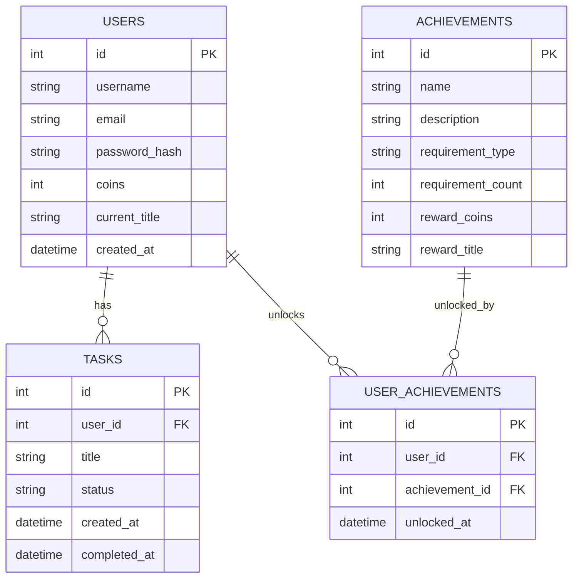

# 資料庫設計文件 (DB Design)：打怪升級待辦清單系統

## 1. ER 圖（實體關係圖）

## 2. 資料表詳細說明

### 2.1 Users (使用者表)
儲存玩家的基本帳號與遊戲資產。
- `id`: INTEGER, Primary Key, 自動遞增。
- `username`: TEXT, 必填, 玩家顯示名稱。
- `email`: TEXT, 必填且唯一, 登入用。
- `password_hash`: TEXT, 必填, 加密後的密碼。
- `coins`: INTEGER, 預設 0, 玩家目前擁有的金幣數量。
- `current_title`: TEXT, 選填, 目前裝備的稱號。
- `created_at`: DATETIME, 預設為當下時間, 註冊時間。

### 2.2 Tasks (任務表)
儲存玩家的日常待辦任務。
- `id`: INTEGER, Primary Key, 自動遞增。
- `user_id`: INTEGER, Foreign Key (對應 Users.id), 必填, 任務擁有者。
- `title`: TEXT, 必填, 任務內容/打怪名稱。
- `status`: TEXT, 預設 'pending' (待完成), 完成後改為 'completed'。
- `created_at`: DATETIME, 預設為當下時間, 任務建立時間。
- `completed_at`: DATETIME, 選填, 任務完成時間。

### 2.3 Achievements (成就設定表)
存放系統預設的成就條件與獎勵。
- `id`: INTEGER, Primary Key, 自動遞增。
- `name`: TEXT, 必填, 成就名稱 (如: 新手村勇者)。
- `description`: TEXT, 成就描述 (如: 完成 1 次任務)。
- `requirement_type`: TEXT, 條件類型 (如: 'task_completed')。
- `requirement_count`: INTEGER, 條件所需次數 (如: 1, 10, 50)。
- `reward_coins`: INTEGER, 預設 0, 達成後給予的金幣。
- `reward_title`: TEXT, 達成後給予的稱號名稱。

### 2.4 User_Achievements (玩家成就解鎖紀錄)
多對多關聯表，紀錄誰解鎖了哪個成就。
- `id`: INTEGER, Primary Key, 自動遞增。
- `user_id`: INTEGER, Foreign Key (對應 Users.id), 必填。
- `achievement_id`: INTEGER, Foreign Key (對應 Achievements.id), 必填。
- `unlocked_at`: DATETIME, 預設為當下時間, 解鎖時間。
