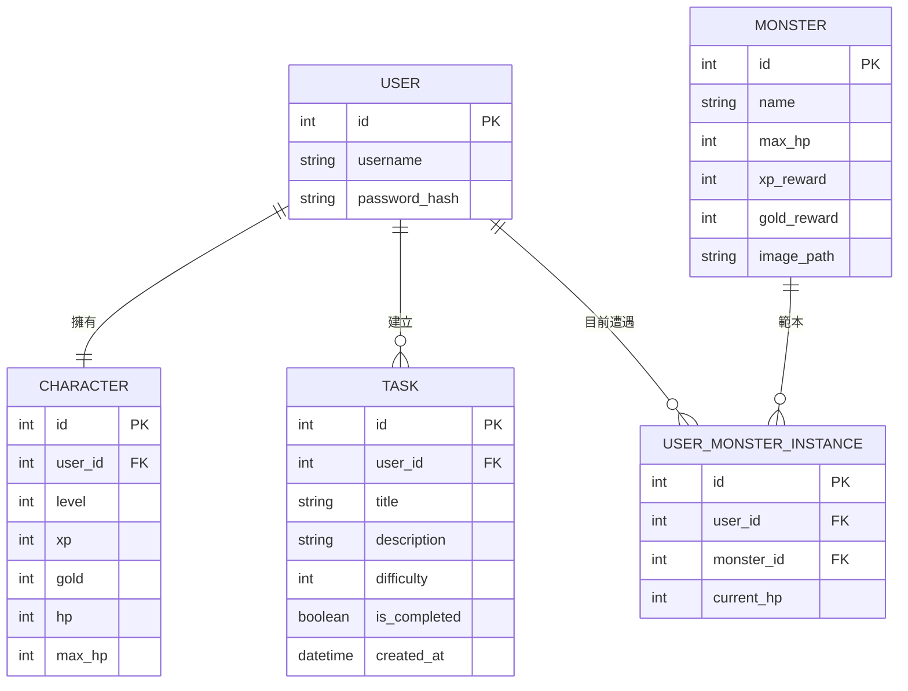

# 資料庫設計 — 生活目標加打怪系統

本文件定義了系統的資料模型、表結構以及 Python 中的 Model 實作方式。

## 1. ER 圖 (Entity Relationship Diagram)

---

## 2. 資料表詳細說明

### 2.1 users (使用者)
| 欄位名 | 型別 | 說明 | 必填 |
| :--- | :--- | :--- | :--- |
| id | INTEGER | Primary Key, 自動遞增 | 是 |
| username | TEXT | 使用者名稱 (唯一) | 是 |
| password_hash | TEXT | 加密後的密碼 | 是 |

### 2.2 characters (角色數值)
| 欄位名 | 型別 | 說明 | 必填 |
| :--- | :--- | :--- | :--- |
| id | INTEGER | Primary Key, 自動遞增 | 是 |
| user_id | INTEGER | Foreign Key (users.id) | 是 |
| level | INTEGER | 目前等級 (預設 1) | 是 |
| xp | INTEGER | 目前經驗值 | 是 |
| gold | INTEGER | 持有金幣 | 是 |
| hp | INTEGER | 目前血量 | 是 |
| max_hp | INTEGER | 血量上限 | 是 |

### 2.3 tasks (任務清單)
| 欄位名 | 型別 | 說明 | 必填 |
| :--- | :--- | :--- | :--- |
| id | INTEGER | Primary Key, 自動遞增 | 是 |
| user_id | INTEGER | Foreign Key (users.id) | 是 |
| title | TEXT | 任務標題 | 是 |
| description | TEXT | 任務細節說明 | 否 |
| difficulty | INTEGER | 難度 (1:容易, 2:普通, 3:困難) | 是 |
| is_completed | BOOLEAN | 是否已完成 (0:否, 1:是) | 是 |
| created_at | DATETIME | 建立時間 | 是 |

### 2.4 monsters (怪物範本庫)
| 欄位名 | 型別 | 說明 | 必填 |
| :--- | :--- | :--- | :--- |
| id | INTEGER | Primary Key, 自動遞增 | 是 |
| name | TEXT | 怪物名稱 | 是 |
| max_hp | INTEGER | 怪物血量上限 | 是 |
| xp_reward | INTEGER | 擊敗後的經驗值獎勵 | 是 |
| gold_reward | INTEGER | 擊敗後的金幣獎勵 | 是 |
| image_path | TEXT | 怪物圖片的路徑 | 是 |

### 2.5 user_monster_instances (使用者當前遭遇怪物)
| 欄位名 | 型別 | 說明 | 必填 |
| :--- | :--- | :--- | :--- |
| id | INTEGER | Primary Key, 自動遞增 | 是 |
| user_id | INTEGER | Foreign Key (users.id) | 是 |
| monster_id | INTEGER | Foreign Key (monsters.id) | 是 |
| current_hp | INTEGER | 該怪物剩餘血量 | 是 |

---

## 3. SQL 建表語法

請參考 `database/schema.sql` 檔案。

---

## 4. Python Model 實作

Model 將採用 `sqlite3` 套件進行實作，每個 Model 類別將封裝 CRUD (Create, Read, Update, Delete) 操作。
檔案位置：`app/models/`
