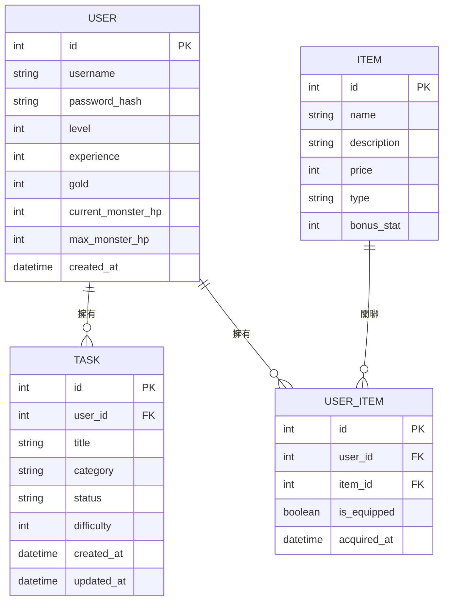

# 資料庫設計文件：生活目標追蹤+打怪系統

## 1. ER 圖 (實體關係圖)

## 2. 資料表詳細說明

### USER (使用者/角色)
儲存使用者基本資訊與遊戲化狀態。

| 欄位名 | 型別 | 說明 | 必填 | 備註 |
| :--- | :--- | :--- | :--- | :--- |
| id | INTEGER | Primary Key | 是 | 自動遞增 |
| username | TEXT | 帳號名稱 | 是 | 唯一值 |
| password_hash | TEXT | 密碼雜湊值 | 是 | |
| level | INTEGER | 目前等級 | 是 | 預設 1 |
| experience | INTEGER | 目前經驗值 | 是 | 預設 0 |
| gold | INTEGER | 持有金幣 | 是 | 預設 0 |
| current_monster_hp | INTEGER | 當前怪物血量 | 是 | 隨等級提升 |
| max_monster_hp | INTEGER | 怪物最大血量 | 是 | 隨等級提升 |
| created_at | DATETIME | 帳號建立時間 | 是 | |

### TASK (生活目標/任務)
儲存使用者的任務清單。

| 欄位名 | 型別 | 說明 | 必填 | 備註 |
| :--- | :--- | :--- | :--- | :--- |
| id | INTEGER | Primary Key | 是 | 自動遞增 |
| user_id | INTEGER | Foreign Key | 是 | 關聯到 USER.id |
| title | TEXT | 任務標題 | 是 | |
| category | TEXT | 任務類別 | 否 | 如：運動、讀書 |
| status | TEXT | 任務狀態 | 是 | todo, done |
| difficulty | INTEGER | 難度等級 | 是 | 影響經驗值與金幣獎勵 |
| created_at | DATETIME | 建立時間 | 是 | |
| updated_at | DATETIME | 更新時間 | 是 | |

### ITEM (商城道具/裝備)
儲存系統中可購買的道具資訊。

| 欄位名 | 型別 | 說明 | 必填 | 備註 |
| :--- | :--- | :--- | :--- | :--- |
| id | INTEGER | Primary Key | 是 | 自動遞增 |
| name | TEXT | 道具名稱 | 是 | |
| description | TEXT | 道具描述 | 否 | |
| price | INTEGER | 售價 | 是 | |
| type | TEXT | 道具種類 | 是 | 如：weapon, armor |
| bonus_stat | INTEGER | 屬性加成 | 是 | 如：增加對怪物的傷害 |

### USER_ITEM (背包/裝備紀錄)
儲存使用者擁有的道具及穿戴狀態。

| 欄位名 | 型別 | 說明 | 必填 | 備註 |
| :--- | :--- | :--- | :--- | :--- |
| id | INTEGER | Primary Key | 是 | 自動遞增 |
| user_id | INTEGER | Foreign Key | 是 | 關聯到 USER.id |
| item_id | INTEGER | Foreign Key | 是 | 關聯到 ITEM.id |
| is_equipped | BOOLEAN | 是否穿戴中 | 是 | 預設 False |
| acquired_at | DATETIME | 獲得時間 | 是 | |

## 3. SQL 建表語法

語法儲存於 `database/schema.sql`。

---

## 4. Python Model 程式碼規劃

模型檔案將儲存於 `app/models/`，包含基本的 CRUD 邏輯。
- `app/models/user.py`
- `app/models/task.py`
- `app/models/item.py`
