# 資料庫設計文件 (DB_DESIGN.md)

本文件定義「生活目標追蹤 + 打怪系統」的資料庫結構。我們採用 SQLite 作為資料庫系統。

## 1. ER 圖 (Entity-Relationship Diagram)

```mermaid
erDiagram
    USER ||--o{ TASK : "擁有"
    USER ||--o{ MONSTER : "正在挑戰"
    USER ||--o{ COMBAT_LOG : "記錄"

    USER {
        int id PK
        string username
        string password_hash
        int level
        int exp
        int gold
        datetime created_at
    }

    TASK {
        int id PK
        int user_id FK
        string title
        int difficulty "1:易, 2:中, 3:難"
        string status "pending / completed"
        datetime created_at
    }

    MONSTER {
        int id PK
        int user_id FK
        string name
        string monster_type
        int max_hp
        int current_hp
        string image_url
        boolean is_alive
        datetime created_at
    }

    COMBAT_LOG {
        int id PK
        int user_id FK
        string action_text
        int damage_dealt
        datetime created_at
    }
```



---

## 2. 資料表詳細說明

### USER (使用者)
| 欄位名 | 型別 | 說明 | 必填 |
| :--- | :--- | :--- | :--- |
| id | INTEGER | 流水號 (PK) | 是 |
| username | TEXT | 帳號名稱 (Unique) | 是 |
| password_hash | TEXT | 加密後的密碼 | 是 |
| level | INTEGER | 目前等級 (預設 1) | 是 |
| exp | INTEGER | 目前經驗值 | 是 |
| gold | INTEGER | 持有金幣 | 是 |
| created_at | DATETIME | 註冊時間 | 是 |

### TASK (任務)
| 欄位名 | 型別 | 說明 | 必填 |
| :--- | :--- | :--- | :--- |
| id | INTEGER | 流水號 (PK) | 是 |
| user_id | INTEGER | 關聯使用者 (FK) | 是 |
| title | TEXT | 任務標題 | 是 |
| difficulty | INTEGER | 難度 (1: 10傷, 2: 30傷, 3: 50傷) | 是 |
| status | TEXT | 狀態 (pending/completed) | 是 |
| created_at | DATETIME | 建立時間 | 是 |

### MONSTER (怪物)
| 欄位名 | 型別 | 說明 | 必填 |
| :--- | :--- | :--- | :--- |
| id | INTEGER | 流水號 (PK) | 是 |
| user_id | INTEGER | 關聯使用者 (正在打這隻怪的人) | 是 |
| name | TEXT | 怪物名稱 | 是 |
| monster_type | TEXT | 怪物種類 (slime, dragon, etc.) | 是 |
| max_hp | INTEGER | 最大血量 | 是 |
| current_hp | INTEGER | 目前血量 | 是 |
| image_url | TEXT | 怪物圖片路徑 | 否 |
| is_alive | BOOLEAN | 是否存活 (1:活, 0:死) | 是 |
| created_at | DATETIME | 出現時間 | 是 |

---

## 3. SQL 建表語法 (database/schema.sql)

```sql
-- 使用者表
CREATE TABLE IF NOT EXISTS users (
    id INTEGER PRIMARY KEY AUTOINCREMENT,
    username TEXT UNIQUE NOT NULL,
    password_hash TEXT NOT NULL,
    level INTEGER DEFAULT 1,
    exp INTEGER DEFAULT 0,
    gold INTEGER DEFAULT 0,
    created_at DATETIME DEFAULT CURRENT_TIMESTAMP
);

-- 任務表
CREATE TABLE IF NOT EXISTS tasks (
    id INTEGER PRIMARY KEY AUTOINCREMENT,
    user_id INTEGER NOT NULL,
    title TEXT NOT NULL,
    difficulty INTEGER DEFAULT 1,
    status TEXT DEFAULT 'pending',
    created_at DATETIME DEFAULT CURRENT_TIMESTAMP,
    FOREIGN KEY (user_id) REFERENCES users (id)
);

-- 怪物表
CREATE TABLE IF NOT EXISTS monsters (
    id INTEGER PRIMARY KEY AUTOINCREMENT,
    user_id INTEGER NOT NULL,
    name TEXT NOT NULL,
    monster_type TEXT NOT NULL,
    max_hp INTEGER NOT NULL,
    current_hp INTEGER NOT NULL,
    image_url TEXT,
    is_alive INTEGER DEFAULT 1,
    created_at DATETIME DEFAULT CURRENT_TIMESTAMP,
    FOREIGN KEY (user_id) REFERENCES users (id)
);

-- 戰鬥日誌
CREATE TABLE IF NOT EXISTS combat_logs (
    id INTEGER PRIMARY KEY AUTOINCREMENT,
    user_id INTEGER NOT NULL,
    action_text TEXT NOT NULL,
    damage_dealt INTEGER DEFAULT 0,
    created_at DATETIME DEFAULT CURRENT_TIMESTAMP,
    FOREIGN KEY (user_id) REFERENCES users (id)
);
```

---
*文件更新日期：2026-05-14*
