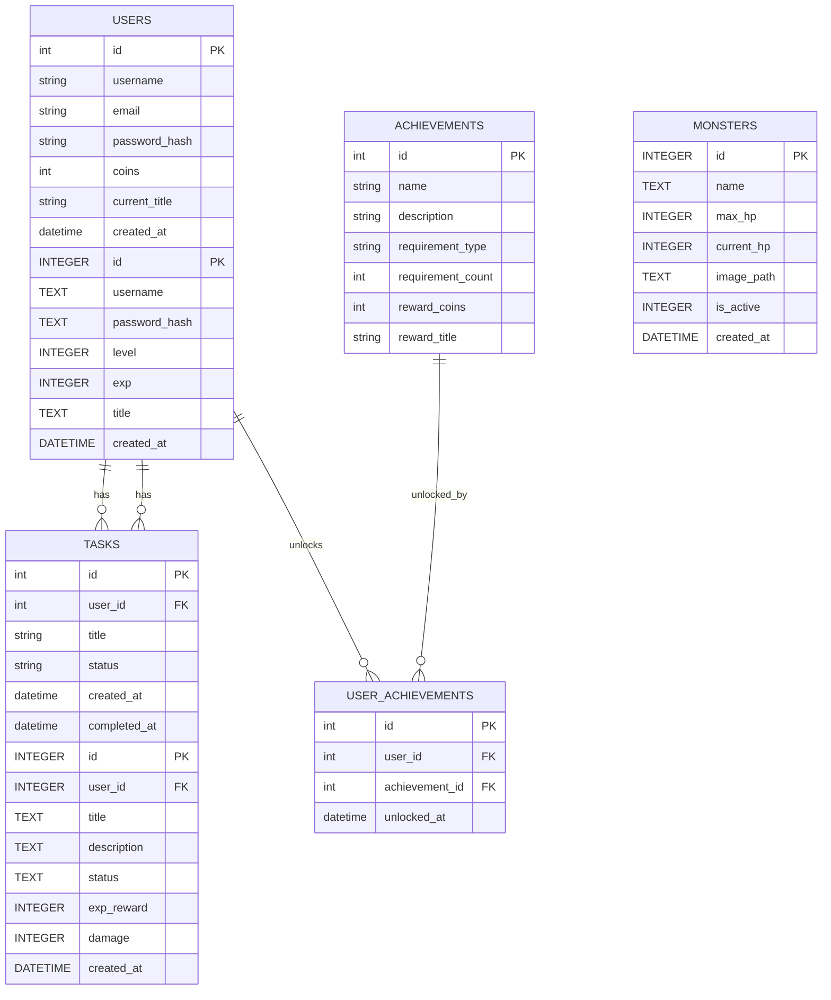

# 資料庫設計文件 (DB Design)：打怪升級待辦清單系統
# 資料庫設計文件 (DB DESIGN)：生活目標打怪追蹤系統 (Daily Game)

## 1. ER 圖（實體關係圖）



## 2. 資料表詳細說明

### 2.1 USERS (使用者表)
儲存使用者的基本資訊與遊戲進度。
- `id` (INTEGER): Primary Key, 自動遞增。
- `username` (TEXT): 使用者帳號，必須唯一且必填。
- `password_hash` (TEXT): 密碼的雜湊值，必填。
- `level` (INTEGER): 當前等級，預設為 1。
- `exp` (INTEGER): 當前經驗值，預設為 0。
- `title` (TEXT): 當前裝備的稱號，可為空。
- `created_at` (DATETIME): 帳號建立時間，自動寫入。

### 2.2 TASKS (任務表)
儲存使用者建立的日常目標。
- `id` (INTEGER): Primary Key, 自動遞增。
- `user_id` (INTEGER): Foreign Key，對應 `USERS.id`，必填。
- `title` (TEXT): 任務標題，必填。
- `description` (TEXT): 任務詳細說明，可為空。
- `status` (TEXT): 任務狀態（如 `pending` 進行中, `completed` 已完成），預設 `pending`。
- `exp_reward` (INTEGER): 完成此任務可獲得的經驗值，預設 10。
- `damage` (INTEGER): 完成此任務可對怪物造成的傷害，預設 10。
- `created_at` (DATETIME): 任務建立時間，自動寫入。

### 2.3 MONSTERS (怪物表)
儲存系統中的怪物資料。
- `id` (INTEGER): Primary Key, 自動遞增。
- `name` (TEXT): 怪物名稱，必填。
- `max_hp` (INTEGER): 怪物最大血量，必填。
- `current_hp` (INTEGER): 怪物當前血量，必填。
- `image_path` (TEXT): 怪物圖片的相對路徑。
- `is_active` (INTEGER): 是否為當前出現的怪物 (1=是, 0=否)。
- `created_at` (DATETIME): 建立時間，自動寫入。
# 資料庫設計文件：生活目標追蹤+打怪系統

## 1. ER 圖 (實體關係圖)
# 資料庫設計文件 (DB_DESIGN.md)

本文件定義「生活目標追蹤 + 打怪系統」的資料庫結構。我們採用 SQLite 作為資料庫系統。

## 1. ER 圖 (Entity-Relationship Diagram)

```mermaid
erDiagram
    USER ||--o{ TASK : "擁有"
    USER ||--o{ USER_ITEM : "擁有"
    ITEM ||--o{ USER_ITEM : "關聯"
    USER ||--o{ MONSTER : "正在挑戰"
    USER ||--o{ COMBAT_LOG : "記錄"
# 資料庫設計 — 生活目標加打怪系統

本文件定義了系統的資料模型、表結構以及 Python 中的 Model 實作方式。

## 1. ER 圖 (Entity Relationship Diagram)

```mermaid
erDiagram
    USER ||--|| CHARACTER : "擁有"
    USER ||--o{ TASK : "建立"
    USER ||--o{ USER_MONSTER_INSTANCE : "目前遭遇"
    MONSTER ||--o{ USER_MONSTER_INSTANCE : "範本"

    USER {
        int id PK
        string username
        string password_hash
        int level
        int experience
        int gold
        int current_monster_hp
        int max_monster_hp
        datetime created_at
    }

        int exp
        int gold
        datetime created_at
    }

    CHARACTER {
        int id PK
        int user_id FK
        int level
        int xp
        int gold
        int hp
        int max_hp
    }

    TASK {
        int id PK
        int user_id FK
        string title
        string category
        string status
        int difficulty
        datetime created_at
        datetime updated_at
    }

    ITEM {
        int id PK
        string name
        string description
        int price
        string type
        int bonus_stat
    }

    USER_ITEM {
        int id PK
        int user_id FK
        int item_id FK
        boolean is_equipped
        datetime acquired_at
    }
```

## 2. 資料表詳細說明

### 2.1 Users (使用者表)
儲存玩家的基本帳號與遊戲資產。
- `id`: INTEGER, Primary Key, 自動遞增。
- `username`: TEXT, 必填, 玩家顯示名稱。
- `email`: TEXT, 必填且唯一, 登入用。
- `password_hash`: TEXT, 必填, 加密後的密碼。
- `coins`: INTEGER, 預設 0, 玩家目前擁有的金幣數量。
- `current_title`: TEXT, 選填, 目前裝備的稱號。
- `created_at`: DATETIME, 預設為當下時間, 註冊時間。

### 2.2 Tasks (任務表)
儲存玩家的日常待辦任務。
- `id`: INTEGER, Primary Key, 自動遞增。
- `user_id`: INTEGER, Foreign Key (對應 Users.id), 必填, 任務擁有者。
- `title`: TEXT, 必填, 任務內容/打怪名稱。
- `status`: TEXT, 預設 'pending' (待完成), 完成後改為 'completed'。
- `created_at`: DATETIME, 預設為當下時間, 任務建立時間。
- `completed_at`: DATETIME, 選填, 任務完成時間。

### 2.3 Achievements (成就設定表)
存放系統預設的成就條件與獎勵。
- `id`: INTEGER, Primary Key, 自動遞增。
- `name`: TEXT, 必填, 成就名稱 (如: 新手村勇者)。
- `description`: TEXT, 成就描述 (如: 完成 1 次任務)。
- `requirement_type`: TEXT, 條件類型 (如: 'task_completed')。
- `requirement_count`: INTEGER, 條件所需次數 (如: 1, 10, 50)。
- `reward_coins`: INTEGER, 預設 0, 達成後給予的金幣。
- `reward_title`: TEXT, 達成後給予的稱號名稱。

### 2.4 User_Achievements (玩家成就解鎖紀錄)
多對多關聯表，紀錄誰解鎖了哪個成就。
- `id`: INTEGER, Primary Key, 自動遞增。
- `user_id`: INTEGER, Foreign Key (對應 Users.id), 必填。
- `achievement_id`: INTEGER, Foreign Key (對應 Achievements.id), 必填。
- `unlocked_at`: DATETIME, 預設為當下時間, 解鎖時間。
### USER (使用者/角色)
儲存使用者基本資訊與遊戲化狀態。

| 欄位名 | 型別 | 說明 | 必填 | 備註 |
| :--- | :--- | :--- | :--- | :--- |
| id | INTEGER | Primary Key | 是 | 自動遞增 |
| username | TEXT | 帳號名稱 | 是 | 唯一值 |
| password_hash | TEXT | 密碼雜湊值 | 是 | |
| level | INTEGER | 目前等級 | 是 | 預設 1 |
| experience | INTEGER | 目前經驗值 | 是 | 預設 0 |
| gold | INTEGER | 持有金幣 | 是 | 預設 0 |
| current_monster_hp | INTEGER | 當前怪物血量 | 是 | 隨等級提升 |
| max_monster_hp | INTEGER | 怪物最大血量 | 是 | 隨等級提升 |
| created_at | DATETIME | 帳號建立時間 | 是 | |

### TASK (生活目標/任務)
儲存使用者的任務清單。

| 欄位名 | 型別 | 說明 | 必填 | 備註 |
| :--- | :--- | :--- | :--- | :--- |
| id | INTEGER | Primary Key | 是 | 自動遞增 |
| user_id | INTEGER | Foreign Key | 是 | 關聯到 USER.id |
| title | TEXT | 任務標題 | 是 | |
| category | TEXT | 任務類別 | 否 | 如：運動、讀書 |
| status | TEXT | 任務狀態 | 是 | todo, done |
| difficulty | INTEGER | 難度等級 | 是 | 影響經驗值與金幣獎勵 |
| created_at | DATETIME | 建立時間 | 是 | |
| updated_at | DATETIME | 更新時間 | 是 | |

### ITEM (商城道具/裝備)
儲存系統中可購買的道具資訊。

| 欄位名 | 型別 | 說明 | 必填 | 備註 |
| :--- | :--- | :--- | :--- | :--- |
| id | INTEGER | Primary Key | 是 | 自動遞增 |
| name | TEXT | 道具名稱 | 是 | |
| description | TEXT | 道具描述 | 否 | |
| price | INTEGER | 售價 | 是 | |
| type | TEXT | 道具種類 | 是 | 如：weapon, armor |
| bonus_stat | INTEGER | 屬性加成 | 是 | 如：增加對怪物的傷害 |

### USER_ITEM (背包/裝備紀錄)
儲存使用者擁有的道具及穿戴狀態。

| 欄位名 | 型別 | 說明 | 必填 | 備註 |
| :--- | :--- | :--- | :--- | :--- |
| id | INTEGER | Primary Key | 是 | 自動遞增 |
| user_id | INTEGER | Foreign Key | 是 | 關聯到 USER.id |
| item_id | INTEGER | Foreign Key | 是 | 關聯到 ITEM.id |
| is_equipped | BOOLEAN | 是否穿戴中 | 是 | 預設 False |
| acquired_at | DATETIME | 獲得時間 | 是 | |

## 3. SQL 建表語法

語法儲存於 `database/schema.sql`。

---

## 4. Python Model 程式碼規劃

模型檔案將儲存於 `app/models/`，包含基本的 CRUD 邏輯。
- `app/models/user.py`
- `app/models/task.py`
- `app/models/item.py`
        int difficulty "1:易, 2:中, 3:難"
        string status "pending / completed"
        string description
        int difficulty
        boolean is_completed
        datetime created_at
    }

    MONSTER {
        int id PK
        int user_id FK
        string name
        string monster_type
        int max_hp
        int current_hp
        string image_url
        boolean is_alive
        datetime created_at
    }

    COMBAT_LOG {
        int id PK
        int user_id FK
        string action_text
        int damage_dealt
        datetime created_at
        string name
        int max_hp
        int xp_reward
        int gold_reward
        string image_path
    }

    USER_MONSTER_INSTANCE {
        int id PK
        int user_id FK
        int monster_id FK
        int current_hp
    }
```

---

## 2. 資料表詳細說明

### USER (使用者)
| 欄位名 | 型別 | 說明 | 必填 |
| :--- | :--- | :--- | :--- |
| id | INTEGER | 流水號 (PK) | 是 |
| username | TEXT | 帳號名稱 (Unique) | 是 |
| password_hash | TEXT | 加密後的密碼 | 是 |
| level | INTEGER | 目前等級 (預設 1) | 是 |
| exp | INTEGER | 目前經驗值 | 是 |
| gold | INTEGER | 持有金幣 | 是 |
| created_at | DATETIME | 註冊時間 | 是 |

### TASK (任務)
| 欄位名 | 型別 | 說明 | 必填 |
| :--- | :--- | :--- | :--- |
| id | INTEGER | 流水號 (PK) | 是 |
| user_id | INTEGER | 關聯使用者 (FK) | 是 |
| title | TEXT | 任務標題 | 是 |
| difficulty | INTEGER | 難度 (1: 10傷, 2: 30傷, 3: 50傷) | 是 |
| status | TEXT | 狀態 (pending/completed) | 是 |
| created_at | DATETIME | 建立時間 | 是 |

### MONSTER (怪物)
| 欄位名 | 型別 | 說明 | 必填 |
| :--- | :--- | :--- | :--- |
| id | INTEGER | 流水號 (PK) | 是 |
| user_id | INTEGER | 關聯使用者 (正在打這隻怪的人) | 是 |
| name | TEXT | 怪物名稱 | 是 |
| monster_type | TEXT | 怪物種類 (slime, dragon, etc.) | 是 |
| max_hp | INTEGER | 最大血量 | 是 |
| current_hp | INTEGER | 目前血量 | 是 |
| image_url | TEXT | 怪物圖片路徑 | 否 |
| is_alive | BOOLEAN | 是否存活 (1:活, 0:死) | 是 |
| created_at | DATETIME | 出現時間 | 是 |

---

## 3. SQL 建表語法 (database/schema.sql)

```sql
-- 使用者表
CREATE TABLE IF NOT EXISTS users (
    id INTEGER PRIMARY KEY AUTOINCREMENT,
    username TEXT UNIQUE NOT NULL,
    password_hash TEXT NOT NULL,
    level INTEGER DEFAULT 1,
    exp INTEGER DEFAULT 0,
    gold INTEGER DEFAULT 0,
    created_at DATETIME DEFAULT CURRENT_TIMESTAMP
);

-- 任務表
CREATE TABLE IF NOT EXISTS tasks (
    id INTEGER PRIMARY KEY AUTOINCREMENT,
    user_id INTEGER NOT NULL,
    title TEXT NOT NULL,
    difficulty INTEGER DEFAULT 1,
    status TEXT DEFAULT 'pending',
    created_at DATETIME DEFAULT CURRENT_TIMESTAMP,
    FOREIGN KEY (user_id) REFERENCES users (id)
);

-- 怪物表
CREATE TABLE IF NOT EXISTS monsters (
    id INTEGER PRIMARY KEY AUTOINCREMENT,
    user_id INTEGER NOT NULL,
    name TEXT NOT NULL,
    monster_type TEXT NOT NULL,
    max_hp INTEGER NOT NULL,
    current_hp INTEGER NOT NULL,
    image_url TEXT,
    is_alive INTEGER DEFAULT 1,
    created_at DATETIME DEFAULT CURRENT_TIMESTAMP,
    FOREIGN KEY (user_id) REFERENCES users (id)
);

-- 戰鬥日誌
CREATE TABLE IF NOT EXISTS combat_logs (
    id INTEGER PRIMARY KEY AUTOINCREMENT,
    user_id INTEGER NOT NULL,
    action_text TEXT NOT NULL,
    damage_dealt INTEGER DEFAULT 0,
    created_at DATETIME DEFAULT CURRENT_TIMESTAMP,
    FOREIGN KEY (user_id) REFERENCES users (id)
);
```

---
*文件更新日期：2026-05-14*
### 2.1 users (使用者)
| 欄位名 | 型別 | 說明 | 必填 |
| :--- | :--- | :--- | :--- |
| id | INTEGER | Primary Key, 自動遞增 | 是 |
| username | TEXT | 使用者名稱 (唯一) | 是 |
| password_hash | TEXT | 加密後的密碼 | 是 |

### 2.2 characters (角色數值)
| 欄位名 | 型別 | 說明 | 必填 |
| :--- | :--- | :--- | :--- |
| id | INTEGER | Primary Key, 自動遞增 | 是 |
| user_id | INTEGER | Foreign Key (users.id) | 是 |
| level | INTEGER | 目前等級 (預設 1) | 是 |
| xp | INTEGER | 目前經驗值 | 是 |
| gold | INTEGER | 持有金幣 | 是 |
| hp | INTEGER | 目前血量 | 是 |
| max_hp | INTEGER | 血量上限 | 是 |

### 2.3 tasks (任務清單)
| 欄位名 | 型別 | 說明 | 必填 |
| :--- | :--- | :--- | :--- |
| id | INTEGER | Primary Key, 自動遞增 | 是 |
| user_id | INTEGER | Foreign Key (users.id) | 是 |
| title | TEXT | 任務標題 | 是 |
| description | TEXT | 任務細節說明 | 否 |
| difficulty | INTEGER | 難度 (1:容易, 2:普通, 3:困難) | 是 |
| is_completed | BOOLEAN | 是否已完成 (0:否, 1:是) | 是 |
| created_at | DATETIME | 建立時間 | 是 |

### 2.4 monsters (怪物範本庫)
| 欄位名 | 型別 | 說明 | 必填 |
| :--- | :--- | :--- | :--- |
| id | INTEGER | Primary Key, 自動遞增 | 是 |
| name | TEXT | 怪物名稱 | 是 |
| max_hp | INTEGER | 怪物血量上限 | 是 |
| xp_reward | INTEGER | 擊敗後的經驗值獎勵 | 是 |
| gold_reward | INTEGER | 擊敗後的金幣獎勵 | 是 |
| image_path | TEXT | 怪物圖片的路徑 | 是 |

### 2.5 user_monster_instances (使用者當前遭遇怪物)
| 欄位名 | 型別 | 說明 | 必填 |
| :--- | :--- | :--- | :--- |
| id | INTEGER | Primary Key, 自動遞增 | 是 |
| user_id | INTEGER | Foreign Key (users.id) | 是 |
| monster_id | INTEGER | Foreign Key (monsters.id) | 是 |
| current_hp | INTEGER | 該怪物剩餘血量 | 是 |

---

## 3. SQL 建表語法

請參考 `database/schema.sql` 檔案。

---

## 4. Python Model 實作

Model 將採用 `sqlite3` 套件進行實作，每個 Model 類別將封裝 CRUD (Create, Read, Update, Delete) 操作。
檔案位置：`app/models/`
