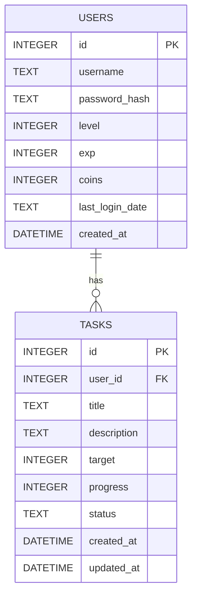

# 資料庫設計文件 (DB Design)

## 1. ER 圖（實體關係圖）

本專案使用 SQLite 作為資料庫，主要包含 `users` (使用者) 與 `tasks` (任務) 兩個實體。一個使用者可以擁有多個每日任務。

---

## 2. 資料表詳細說明

### 2.1 USERS (使用者資料表)
儲存玩家的基本資訊、角色狀態（等級、經驗值、金幣）以及用來判斷是否跨日的 `last_login_date`。

| 欄位名稱 | 型別 | 必填 | 說明 |
| --- | --- | --- | --- |
| `id` | INTEGER | 是 | Primary Key，自動遞增。 |
| `username` | TEXT | 是 | 使用者帳號，必須唯一。 |
| `password_hash` | TEXT | 是 | 經過雜湊加密的密碼。 |
| `level` | INTEGER | 是 | 角色等級（預設 1）。 |
| `exp` | INTEGER | 是 | 角色目前經驗值（預設 0）。 |
| `coins` | INTEGER | 是 | 玩家擁有的金幣數量（預設 0）。 |
| `last_login_date` | TEXT | 否 | 紀錄最後一次登入的「日期」(如 `YYYY-MM-DD`)，用來判斷跨日重置。 |
| `created_at` | DATETIME | 是 | 帳號建立時間。 |

### 2.2 TASKS (任務資料表)
儲存使用者的每日任務清單與進度。

| 欄位名稱 | 型別 | 必填 | 說明 |
| --- | --- | --- | --- |
| `id` | INTEGER | 是 | Primary Key，自動遞增。 |
| `user_id` | INTEGER | 是 | Foreign Key，關聯至 `users.id`。 |
| `title` | TEXT | 是 | 任務標題（如：完成1次登入）。 |
| `description` | TEXT | 否 | 任務詳細描述。 |
| `target` | INTEGER | 是 | 任務目標次數（如：擊敗3隻怪物，目標為 3。預設為 1）。 |
| `progress` | INTEGER | 是 | 目前完成進度（預設為 0）。 |
| `status` | TEXT | 是 | 任務狀態（`pending` 未完成 / `completed` 已完成）。 |
| `created_at` | DATETIME | 是 | 任務建立時間。 |
| `updated_at` | DATETIME | 是 | 任務最後更新時間。 |

---

## 3. SQL 建表語法
SQL 建表語法已經儲存於 `database/schema.sql` 中。我們將使用此檔案來初始化 SQLite 資料庫。

---

## 4. Python Model 程式碼
因應專案架構，我們採用原生的 `sqlite3` 模組來實作輕量級的資料存取層 (Data Access Object)。
模型檔案儲存於 `app/models/` 目錄中：
- `user_model.py`: 負責處理 `users` 資料表的 CRUD 與經驗值發放。
- `task_model.py`: 負責處理 `tasks` 資料表的 CRUD、進度更新與重置邏輯。
- `database.py`: 負責建立資料庫連線與初始化資料表。
