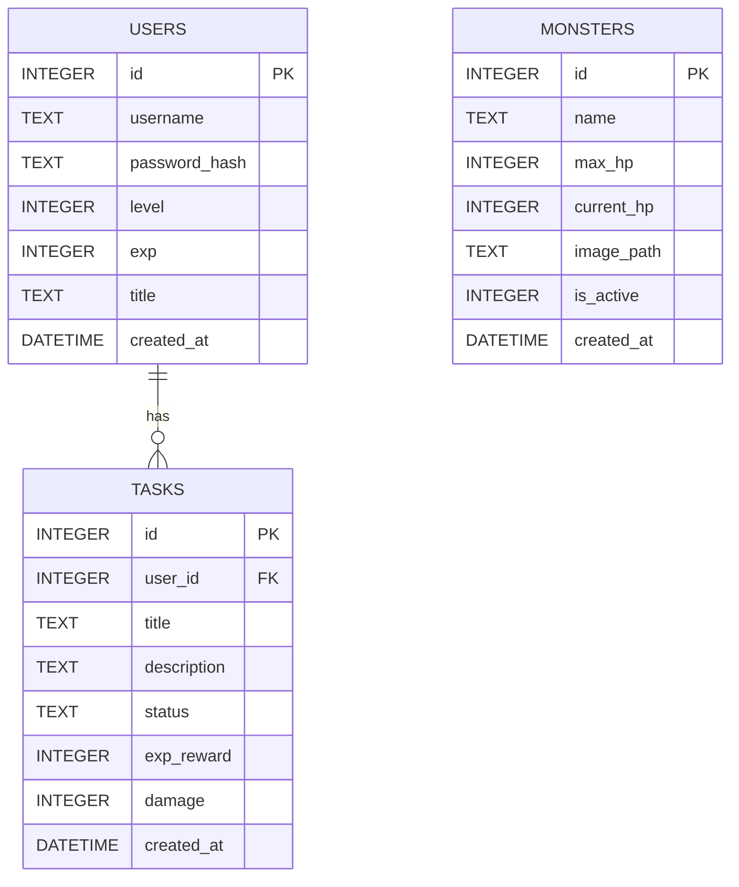

# 資料庫設計文件 (DB DESIGN)：生活目標打怪追蹤系統 (Daily Game)

## 1. ER 圖（實體關係圖）

## 2. 資料表詳細說明

### 2.1 USERS (使用者表)
儲存使用者的基本資訊與遊戲進度。
- `id` (INTEGER): Primary Key, 自動遞增。
- `username` (TEXT): 使用者帳號，必須唯一且必填。
- `password_hash` (TEXT): 密碼的雜湊值，必填。
- `level` (INTEGER): 當前等級，預設為 1。
- `exp` (INTEGER): 當前經驗值，預設為 0。
- `title` (TEXT): 當前裝備的稱號，可為空。
- `created_at` (DATETIME): 帳號建立時間，自動寫入。

### 2.2 TASKS (任務表)
儲存使用者建立的日常目標。
- `id` (INTEGER): Primary Key, 自動遞增。
- `user_id` (INTEGER): Foreign Key，對應 `USERS.id`，必填。
- `title` (TEXT): 任務標題，必填。
- `description` (TEXT): 任務詳細說明，可為空。
- `status` (TEXT): 任務狀態（如 `pending` 進行中, `completed` 已完成），預設 `pending`。
- `exp_reward` (INTEGER): 完成此任務可獲得的經驗值，預設 10。
- `damage` (INTEGER): 完成此任務可對怪物造成的傷害，預設 10。
- `created_at` (DATETIME): 任務建立時間，自動寫入。

### 2.3 MONSTERS (怪物表)
儲存系統中的怪物資料。
- `id` (INTEGER): Primary Key, 自動遞增。
- `name` (TEXT): 怪物名稱，必填。
- `max_hp` (INTEGER): 怪物最大血量，必填。
- `current_hp` (INTEGER): 怪物當前血量，必填。
- `image_path` (TEXT): 怪物圖片的相對路徑。
- `is_active` (INTEGER): 是否為當前出現的怪物 (1=是, 0=否)。
- `created_at` (DATETIME): 建立時間，自動寫入。
