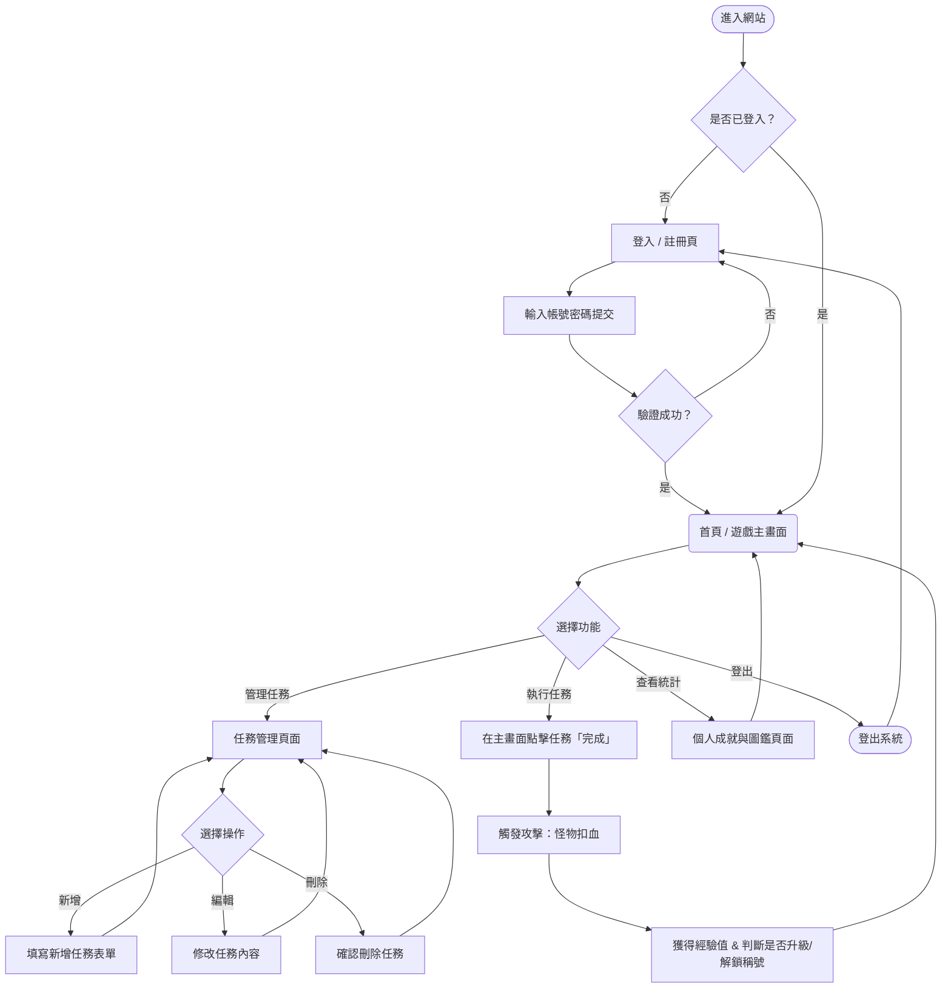
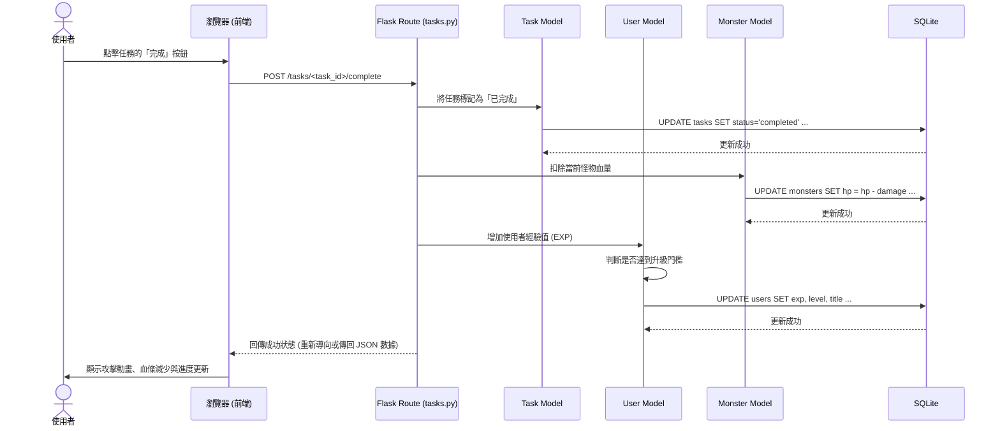

# 流程圖文件 (FLOWCHART)：生活目標打怪追蹤系統 (Daily Game)

本文件將根據 PRD 的需求與系統架構，將使用者的操作路徑與系統內部的資料流視覺化。

---

## 1. 使用者流程圖 (User Flow)

此流程圖描述使用者從進入系統到操作各項功能的完整路徑。

---

## 2. 系統序列圖 (Sequence Diagram)

以下以系統最核心的**「完成任務並打怪升級」**為例，展示前端瀏覽器、Flask 路由、Model 與 SQLite 資料庫之間的完整互動。

---

## 3. 功能清單與路由對照表

以下整理了系統內預計實作的主要功能、對應的 URL 路徑與 HTTP 方法。

| 功能模組 | 操作描述 | URL 路徑 (建議) | HTTP 方法 |
|---|---|---|---|
| **認證 (Auth)** | 註冊新帳號 | `/register` | GET (頁面), POST (送出) |
| **認證 (Auth)** | 使用者登入 | `/login` | GET (頁面), POST (送出) |
| **認證 (Auth)** | 使用者登出 | `/logout` | GET 或 POST |
| **主畫面 (Main)** | 顯示遊戲主畫面與今日任務 | `/` | GET |
| **任務 (Tasks)** | 查看所有任務列表 | `/tasks` | GET |
| **任務 (Tasks)** | 新增任務 | `/tasks/create` | GET (表單), POST (送出) |
| **任務 (Tasks)** | 編輯任務 | `/tasks/<id>/edit` | GET (表單), POST (送出) |
| **任務 (Tasks)** | 刪除任務 | `/tasks/<id>/delete` | POST |
| **任務 (Tasks)** | 完成任務 (觸發打怪) | `/tasks/<id>/complete`| POST |
| **統計 (Stats)**| 查看個人數據、稱號與圖鑑 | `/stats` | GET |
