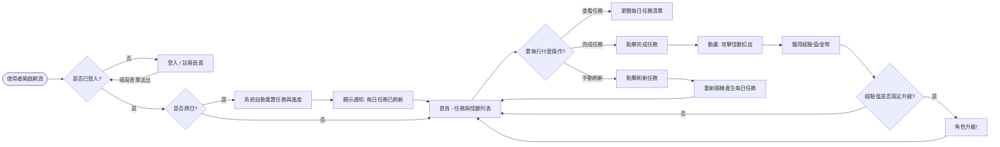
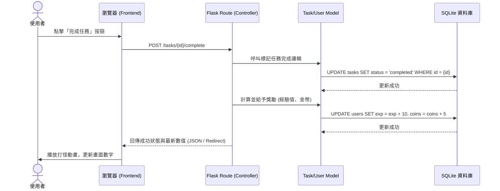

# 系統流程圖與功能對照表 (Flowcharts)

本文件包含了「生活目標追蹤與打怪系統」的使用者流程圖與系統序列圖，幫助我們了解使用者在操作系統時的路徑，以及資料流動的細節。

---

## 1. 使用者流程圖 (User Flow)

這張圖描述了使用者從進入系統到完成各項操作的完整路徑。包含了登入、查看任務、完成任務（打怪）、領取獎勵以及觸發每日重置的情境。

---

## 2. 系統序列圖 (Sequence Diagram)

這張圖展示了當使用者「點擊完成任務（打怪）」並觸發後端更新的具體資料流與系統互動。

---

## 3. 功能清單對照表

以下整理了系統主要功能對應的 URL 路徑與 HTTP 請求方法，這將作為後續實作路由（Routes）的依據。

| 功能名稱 | URL 路徑 | HTTP 方法 | 說明 |
| --- | --- | --- | --- |
| **登入頁面** | `/login` | GET / POST | 顯示登入表單 / 處理使用者登入驗證 |
| **註冊頁面** | `/register` | GET / POST | 顯示註冊表單 / 處理新使用者建立 |
| **首頁 (任務列表)** | `/` | GET | 顯示目前的每日任務清單、玩家狀態與怪獸資訊，並執行跨日檢查 |
| **新增任務** | `/tasks` | POST | 允許使用者手動新增日常任務 |
| **完成任務 (打怪)** | `/tasks/<int:id>/complete` | POST | 標記特定任務為完成，並發放經驗值/金幣 |
| **手動刷新任務** | `/tasks/refresh` | POST | 重新隨機產生或更換每日任務內容 |
| **取得玩家狀態** | `/user/status` | GET | 取得最新的等級、經驗值、金幣數量（可供 AJAX 呼叫更新畫面） |
