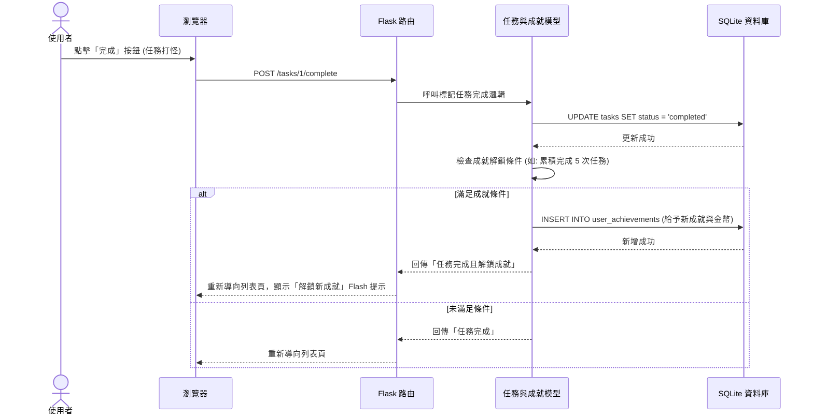

# 流程圖設計文件 (Flowchart)：打怪升級待辦清單系統

## 1. 使用者流程圖（User Flow）

以下流程圖展示了使用者在網站中的主要操作路徑。從進入網站開始，包含註冊登入、新增與完成任務，以及查看成就與排行榜等互動。

---

## 2. 系統序列圖（Sequence Diagram）

以下序列圖展示了最核心的流程：**「使用者完成任務並觸發成就解鎖」** 的系統內部互動狀況，描述了前端、路由、模型與資料庫之間的資料流動。

---

## 3. 功能清單對照表

整理本系統目前規劃的所有功能、對應的 URL 路徑與 HTTP 方法，作為後續開發路由與 API 的依據。

| 功能模組 | 具體操作 | URL 路徑 | HTTP 方法 | 說明 |
| --- | --- | --- | --- | --- |
| **會員系統** | 顯示註冊頁面 / 註冊 | `/register` | GET / POST | 處理新使用者註冊 |
| | 顯示登入頁面 / 登入 | `/login` | GET / POST | 處理使用者登入驗證 |
| | 登出 | `/logout` | GET | 清除 Session 並登出 |
| **任務系統** | 任務列表 (首頁) | `/` 或 `/tasks` | GET | 顯示目前所有未完成與已完成的任務 |
| | 新增任務 | `/tasks` | POST | 提交新任務的表單資料 |
| | 完成任務 (打怪) | `/tasks/<task_id>/complete` | POST | 標記指定任務為完成，並觸發成就檢查 |
| | 刪除任務 | `/tasks/<task_id>/delete` | POST | 刪除指定的任務 |
| **成就系統** | 個人成就與背包展示 | `/profile` 或 `/achievements` | GET | 顯示玩家累積的金幣、稱號及獲得徽章 |
| | 成就排行榜 | `/leaderboard` | GET | 顯示全伺服器的成就數量排名 |
