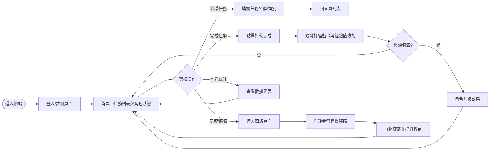
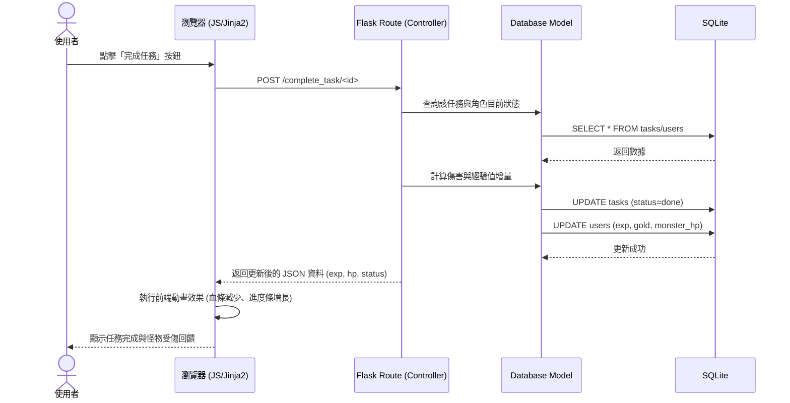

# 流程圖文件：生活目標追蹤+打怪系統

## 1. 使用者流程圖 (User Flow)

此圖描述使用者進入網站後的操作路徑，涵蓋核心的任務管理與打怪升級流程。

## 2. 系統序列圖 (Sequence Diagram)

此圖以「完成任務並打怪」為例，展示資料如何在各元件間流動。

## 3. 功能清單對照表

以下為本系統規劃的主要功能及其對應的路徑：

| 功能名稱 | URL 路徑 | HTTP 方法 | 說明 |
| :--- | :--- | :--- | :--- |
| 首頁 / 任務列表 | `/` | GET | 顯示所有任務、角色血條、經驗值與怪物狀態 |
| 使用者註冊 | `/register` | GET/POST | 新增使用者帳號 |
| 使用者登入 | `/login` | GET/POST | 驗證身份並登入 |
| 新增任務 | `/task/add` | POST | 建立新的生活目標 |
| 完成任務 | `/task/complete/<id>` | POST | 標記任務完成並觸發打怪邏輯 |
| 編輯/刪除任務 | `/task/edit/<id>` / `/task/delete/<id>` | POST | 管理現有任務 |
| 商城頁面 | `/shop` | GET | 顯示可購買的裝備或道具 |
| 購買裝備 | `/shop/buy/<item_id>` | POST | 消耗金幣購買並穿戴裝備 |
| 數據統計 | `/stats` | GET | 顯示週/月達成率圖表 |

---

這些流程圖與表格能幫助開發團隊更清楚地理解系統的運作邏輯，避免在實作路由與資料庫邏輯時出現遺漏。
