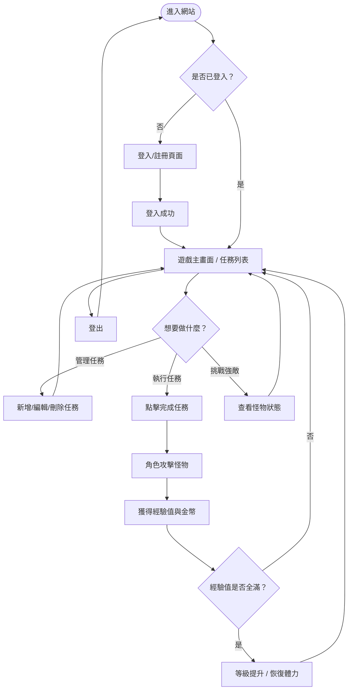
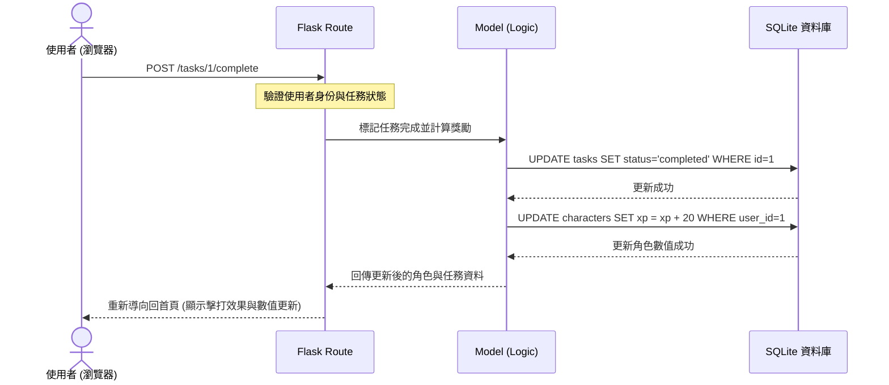

# 流程圖設計 — 生活目標加打怪系統

本文件視覺化了使用者的操作路徑以及系統內部的資料流向，確保功能設計符合 PRD 需求。

## 1. 使用者流程圖 (User Flow)

描述使用者進入系統後的所有操作可能路徑。

---

## 2. 系統序列圖 (Sequence Diagram) — 以「完成任務並攻擊」為例

描述當使用者完成一個任務時，資料在各元件間的流動。

---

## 3. 功能清單與路徑對照表

根據架構設計與功能需求，規劃以下 URL 路徑：

| 功能類別 | 功能名稱 | URL 路徑 | HTTP 方法 | 說明 |
| :--- | :--- | :--- | :--- | :--- |
| **認證** | 註冊帳號 | `/auth/register` | GET, POST | 顯示註冊表單 / 儲存新帳號 |
| **認證** | 登入系統 | `/auth/login` | GET, POST | 顯示登入頁面 / 驗證身份 |
| **認證** | 登出 | `/auth/logout` | POST | 清除 Session 並登出 |
| **主遊戲** | 遊戲大廳/首頁 | `/` | GET | 顯示目前怪物、角色狀態與任務簡述 |
| **任務管理** | 任務清單頁面 | `/tasks` | GET | 檢視所有進行中與已完成的任務 |
| **任務管理** | 新增任務 | `/tasks/add` | GET, POST | 顯示新增表單 / 儲存任務資料 |
| **任務管理** | 編輯任務 | `/tasks/edit/<id>` | GET, POST | 修改現有任務內容 |
| **任務管理** | 刪除任務 | `/tasks/delete/<id>` | POST | 永久移除任務 |
| **打怪機制** | 完成任務並攻擊 | `/tasks/complete/<id>` | POST | 觸發攻擊怪物邏輯與獲取經驗值 |

---
