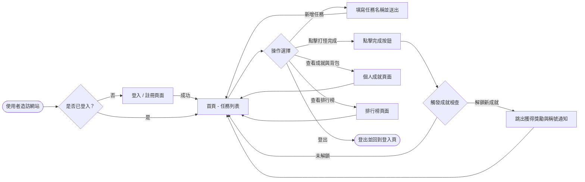
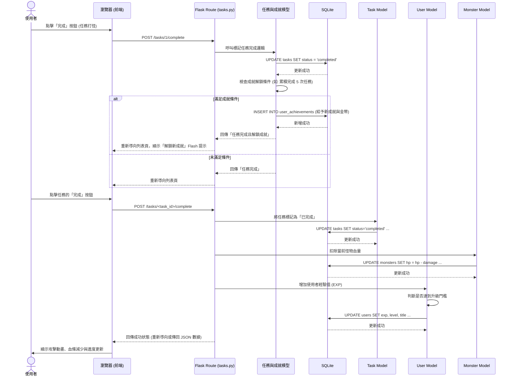
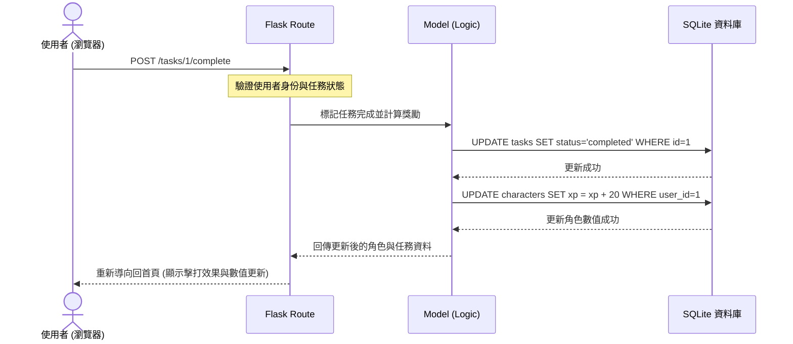

# 流程圖設計文件 (Flowchart)：打怪升級待辦清單系統

## 1. 使用者流程圖（User Flow）

以下流程圖展示了使用者在網站中的主要操作路徑。從進入網站開始，包含註冊登入、新增與完成任務，以及查看成就與排行榜等互動。



---

## 2. 系統序列圖（Sequence Diagram）

以下序列圖展示了最核心的流程：**「使用者完成任務並觸發成就解鎖」** 的系統內部互動狀況，描述了前端、路由、模型與資料庫之間的資料流動。
# 流程圖文件 (FLOWCHART)：生活目標打怪追蹤系統 (Daily Game)

本文件將根據 PRD 的需求與系統架構，將使用者的操作路徑與系統內部的資料流視覺化。

---

## 1. 使用者流程圖 (User Flow)

此流程圖描述使用者從進入系統到操作各項功能的完整路徑。

```mermaid
flowchart TD
    Start([進入網站]) --> CheckLogin{是否已登入？}
    
    CheckLogin -->|否| LoginPage[登入 / 註冊頁]
    LoginPage --> ProcessAuth[輸入帳號密碼提交]
    ProcessAuth --> CheckAuthResult{驗證成功？}
    CheckAuthResult -->|否| LoginPage
    CheckAuthResult -->|是| Main(首頁 / 遊戲主畫面)

    CheckLogin -->|是| Main

    Main --> CheckAction{選擇功能}

    %% 任務管理流程
    CheckAction -->|管理任務| TaskList[任務管理頁面]
    TaskList --> TaskAction{選擇操作}
    TaskAction -->|新增| CreateTask[填寫新增任務表單] --> TaskList
    TaskAction -->|編輯| EditTask[修改任務內容] --> TaskList
    TaskAction -->|刪除| DeleteTask[確認刪除任務] --> TaskList

    %% 打怪核心流程
    CheckAction -->|執行任務| CompleteTask[在主畫面點擊任務「完成」]
    CompleteTask --> BattleLogic[觸發攻擊：怪物扣血]
    BattleLogic --> CalculateEXP[獲得經驗值 & 判斷是否升級/解鎖稱號]
    CalculateEXP --> Main

    %% 數據統計流程
    CheckAction -->|查看統計| StatsPage[個人成就與圖鑑頁面]
    StatsPage --> Main

    %% 登出流程
    CheckAction -->|登出| Logout([登出系統]) --> LoginPage
# 流程圖文件：生活目標追蹤+打怪系統

## 1. 使用者流程圖 (User Flow)

此圖描述使用者進入網站後的操作路徑，涵蓋核心的任務管理與打怪升級流程。

```mermaid
flowchart LR
    Start([進入網站]) --> Login[登入/註冊頁面]
    Login --> Home[首頁 - 任務列表與角色狀態]
    
    Home --> Action{選擇操作}
    
    Action -->|新增任務| CreateTask[填寫任務名稱/類別]
    CreateTask --> TaskList[回首頁列表]
    
    Action -->|完成任務| CompleteTask[點擊打勾完成]
    CompleteTask --> Animation[觸發打怪動畫與經驗值增加]
    Animation --> LevelUp{經驗值滿?}
    LevelUp -->|是| LevelEffect[角色升級效果]
    LevelUp -->|否| Home
    LevelEffect --> Home
    
    Action -->|商城/裝備| Shop[進入商城頁面]
    Shop --> Buy[消耗金幣購買裝備]
    Buy --> Equip[自動穿戴並提升數值]
    Equip --> Home
    
    Action -->|查看統計| Statistics[查看數據圖表]
    Statistics --> Home
```

## 2. 系統序列圖 (Sequence Diagram)

此圖以「完成任務並打怪」為例，展示資料如何在各元件間流動。
# 流程圖文件 (FLOWCHART.md)

本文件描述「生活目標追蹤 + 打怪系統」的使用者操作路徑與系統資料流。

## 1. 使用者流程圖 (User Flow)

描述使用者從進入網站到完成任務、提升等級的完整歷程。


---

## 2. 系統序列圖 (Sequence Diagram)

以下以系統最核心的**「完成任務並打怪升級」**為例，展示前端瀏覽器、Flask 路由、Model 與 SQLite 資料庫之間的完整互動。
以「完成任務並扣除怪物血量」為例，展示後端處理流程。



---

## 3. 功能清單與路由對照表

以下整理了系統內預計實作的主要功能、對應的 URL 路徑與 HTTP 方法。

| 功能模組 | 操作描述 | URL 路徑 (建議) | HTTP 方法 |
|---|---|---|---|
| **認證 (Auth)** | 註冊新帳號 | `/register` | GET (頁面), POST (送出) |
| **認證 (Auth)** | 使用者登入 | `/login` | GET (頁面), POST (送出) |
| **認證 (Auth)** | 使用者登出 | `/logout` | GET 或 POST |
| **主畫面 (Main)** | 顯示遊戲主畫面與今日任務 | `/` | GET |
| **任務 (Tasks)** | 查看所有任務列表 | `/tasks` | GET |
| **任務 (Tasks)** | 新增任務 | `/tasks/create` | GET (表單), POST (送出) |
| **任務 (Tasks)** | 編輯任務 | `/tasks/<id>/edit` | GET (表單), POST (送出) |
| **任務 (Tasks)** | 刪除任務 | `/tasks/<id>/delete` | POST |
| **任務 (Tasks)** | 完成任務 (觸發打怪) | `/tasks/<id>/complete`| POST |
| **統計 (Stats)**| 查看個人數據、稱號與圖鑑 | `/stats` | GET |
    participant Browser as 瀏覽器 (JS/Jinja2)
    participant Flask as Flask Route (Controller)
    participant Model as Database Model
    participant DB as SQLite

    User->>Browser: 點擊「完成任務」按鈕
    Browser->>Flask: POST /complete_task/<id>
    
    Flask->>Model: 查詢該任務與角色目前狀態
    Model->>DB: SELECT * FROM tasks/users
    DB-->>Model: 返回數據
    
    Flask->>Model: 計算傷害與經驗值增量
    Model->>DB: UPDATE tasks (status=done)
    Model->>DB: UPDATE users (exp, gold, monster_hp)
    DB-->>Model: 更新成功
    
    Flask-->>Browser: 返回更新後的 JSON 資料 (exp, hp, status)
    
    Browser->>Browser: 執行前端動畫效果 (血條減少、進度條增長)
    Browser-->>User: 顯示任務完成與怪物受傷回饋
```

## 3. 功能清單對照表

以下為本系統規劃的主要功能及其對應的路徑：

| 功能名稱 | URL 路徑 | HTTP 方法 | 說明 |
| :--- | :--- | :--- | :--- |
| 首頁 / 任務列表 | `/` | GET | 顯示所有任務、角色血條、經驗值與怪物狀態 |
| 使用者註冊 | `/register` | GET/POST | 新增使用者帳號 |
| 使用者登入 | `/login` | GET/POST | 驗證身份並登入 |
| 新增任務 | `/task/add` | POST | 建立新的生活目標 |
| 完成任務 | `/task/complete/<id>` | POST | 標記任務完成並觸發打怪邏輯 |
| 編輯/刪除任務 | `/task/edit/<id>` / `/task/delete/<id>` | POST | 管理現有任務 |
| 商城頁面 | `/shop` | GET | 顯示可購買的裝備或道具 |
| 購買裝備 | `/shop/buy/<item_id>` | POST | 消耗金幣購買並穿戴裝備 |
| 數據統計 | `/stats` | GET | 顯示週/月達成率圖表 |

---

這些流程圖與表格能幫助開發團隊更清楚地理解系統的運作邏輯，避免在實作路由與資料庫邏輯時出現遺漏。
    participant Browser as 瀏覽器
    participant Flask as Flask Route
    participant Model as 業務邏輯 / Model
    participant DB as SQLite 資料庫

    User->>Browser: 點擊「完成任務」核取方塊
    Browser->>Flask: POST /tasks/complete/<id>
    
    Flask->>DB: 查詢任務詳情與目前怪物狀態
    DB-->>Flask: 回傳資料
    
    Flask->>Model: 計算傷害 (根據任務難度)
    Model-->>Flask: 傷害數值
    
    Flask->>DB: UPDATE monsters SET hp = hp - damage
    Flask->>DB: UPDATE tasks SET status = 'completed'
    
    alt 怪物被擊敗
        Flask->>Model: 計算經驗值與獎勵
        Flask->>DB: UPDATE users SET exp = exp + reward_exp
        DB-->>Flask: 成功
    end
    
    DB-->>Flask: 提交事務
    Flask-->>Browser: Redirect 或回傳 JSON 成功訊息
    Browser-->>User: 顯示戰鬥結果與動畫
```

---

## 3. 功能清單對照表

整理本系統目前規劃的所有功能、對應的 URL 路徑與 HTTP 方法，作為後續開發路由與 API 的依據。

| 功能模組 | 具體操作 | URL 路徑 | HTTP 方法 | 說明 |
| --- | --- | --- | --- | --- |
| **會員系統** | 顯示註冊頁面 / 註冊 | `/register` | GET / POST | 處理新使用者註冊 |
| | 顯示登入頁面 / 登入 | `/login` | GET / POST | 處理使用者登入驗證 |
| | 登出 | `/logout` | GET | 清除 Session 並登出 |
| **任務系統** | 任務列表 (首頁) | `/` 或 `/tasks` | GET | 顯示目前所有未完成與已完成的任務 |
| | 新增任務 | `/tasks` | POST | 提交新任務的表單資料 |
| | 完成任務 (打怪) | `/tasks/<task_id>/complete` | POST | 標記指定任務為完成，並觸發成就檢查 |
| | 刪除任務 | `/tasks/<task_id>/delete` | POST | 刪除指定的任務 |
| **成就系統** | 個人成就與背包展示 | `/profile` 或 `/achievements` | GET | 顯示玩家累積的金幣、稱號及獲得徽章 |
| | 成就排行榜 | `/leaderboard` | GET | 顯示全伺服器的成就數量排名 |
| 功能名稱 | URL 路徑 | HTTP 方法 | 說明 |
| :--- | :--- | :--- | :--- |
| **首頁/儀表板** | `/` | GET | 顯示目前怪物、角色狀態與任務清單 |
| **登入** | `/login` | GET/POST | 使用者驗證 |
| **註冊** | `/register` | GET/POST | 建立新帳號 |
| **新增任務** | `/tasks/add` | POST | 建立新的待辦事項 |
| **編輯任務** | `/tasks/edit/<id>` | GET/POST | 修改任務名稱或難度 |
| **刪除任務** | `/tasks/delete/<id>` | POST | 移除任務 |
| **完成任務** | `/tasks/complete/<id>` | POST | 觸發戰鬥、計算傷害 |
| **商店/獎勵** | `/shop` | GET | 查看可兌換的獎勵或道具 |

---
*文件更新日期：2026-05-14*
# 流程圖設計 — 生活目標加打怪系統

本文件視覺化了使用者的操作路徑以及系統內部的資料流向，確保功能設計符合 PRD 需求。

## 1. 使用者流程圖 (User Flow)

描述使用者進入系統後的所有操作可能路徑。


---

## 2. 系統序列圖 (Sequence Diagram) — 以「完成任務並攻擊」為例

描述當使用者完成一個任務時，資料在各元件間的流動。



---

## 3. 功能清單與路徑對照表

根據架構設計與功能需求，規劃以下 URL 路徑：

| 功能類別 | 功能名稱 | URL 路徑 | HTTP 方法 | 說明 |
| :--- | :--- | :--- | :--- | :--- |
| **認證** | 註冊帳號 | `/auth/register` | GET, POST | 顯示註冊表單 / 儲存新帳號 |
| **認證** | 登入系統 | `/auth/login` | GET, POST | 顯示登入頁面 / 驗證身份 |
| **認證** | 登出 | `/auth/logout` | POST | 清除 Session 並登出 |
| **主遊戲** | 遊戲大廳/首頁 | `/` | GET | 顯示目前怪物、角色狀態與任務簡述 |
| **任務管理** | 任務清單頁面 | `/tasks` | GET | 檢視所有進行中與已完成的任務 |
| **任務管理** | 新增任務 | `/tasks/add` | GET, POST | 顯示新增表單 / 儲存任務資料 |
| **任務管理** | 編輯任務 | `/tasks/edit/<id>` | GET, POST | 修改現有任務內容 |
| **任務管理** | 刪除任務 | `/tasks/delete/<id>` | POST | 永久移除任務 |
| **打怪機制** | 完成任務並攻擊 | `/tasks/complete/<id>` | POST | 觸發攻擊怪物邏輯與獲取經驗值 |

---
