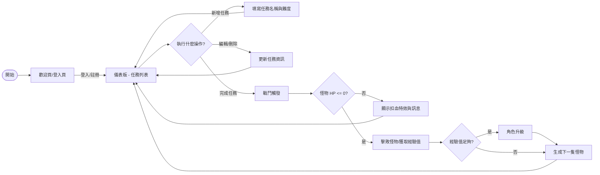
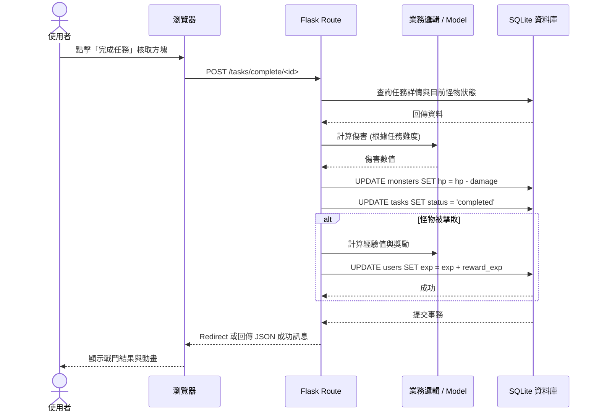

# 流程圖文件 (FLOWCHART.md)

本文件描述「生活目標追蹤 + 打怪系統」的使用者操作路徑與系統資料流。

## 1. 使用者流程圖 (User Flow)

描述使用者從進入網站到完成任務、提升等級的完整歷程。

---

## 2. 系統序列圖 (Sequence Diagram)

以「完成任務並扣除怪物血量」為例，展示後端處理流程。

---

## 3. 功能清單對照表

| 功能名稱 | URL 路徑 | HTTP 方法 | 說明 |
| :--- | :--- | :--- | :--- |
| **首頁/儀表板** | `/` | GET | 顯示目前怪物、角色狀態與任務清單 |
| **登入** | `/login` | GET/POST | 使用者驗證 |
| **註冊** | `/register` | GET/POST | 建立新帳號 |
| **新增任務** | `/tasks/add` | POST | 建立新的待辦事項 |
| **編輯任務** | `/tasks/edit/<id>` | GET/POST | 修改任務名稱或難度 |
| **刪除任務** | `/tasks/delete/<id>` | POST | 移除任務 |
| **完成任務** | `/tasks/complete/<id>` | POST | 觸發戰鬥、計算傷害 |
| **商店/獎勵** | `/shop` | GET | 查看可兌換的獎勵或道具 |

---
*文件更新日期：2026-05-14*
